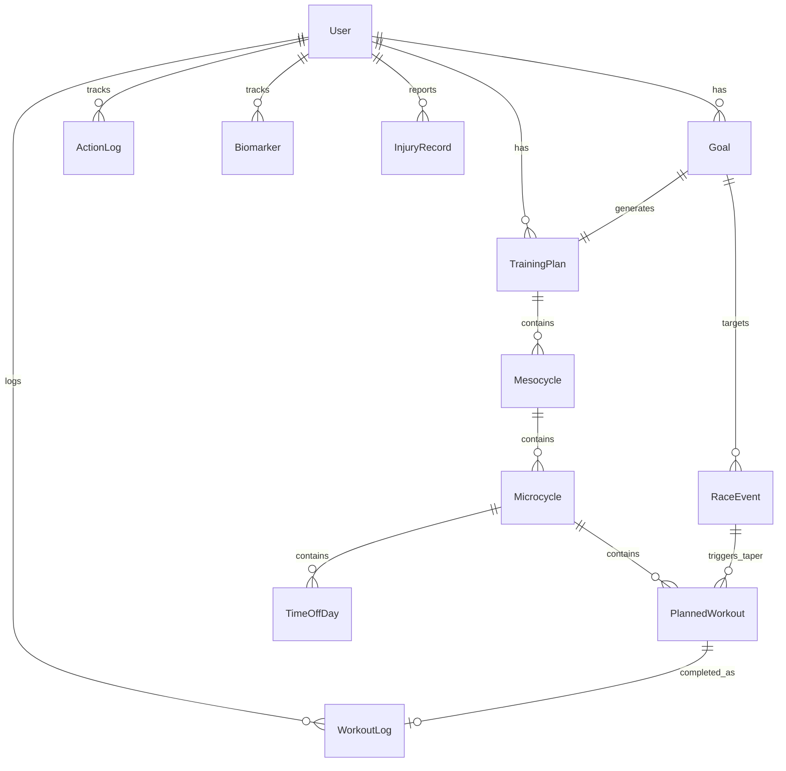

# Data Models & Schema

This directory defines the core data structures, database schema, and relationships for the Ash Trainer app.

## 1. Technology Stack

**Database:** Drift (SQLite wrapper for Flutter)
- **Why?** Type-safe, reactive streams, offline-first, excellent for complex queries
- **Location:** Local device storage (primary), optional cloud backup

**Key-Value Store:** Shared Preferences
- **Why?** Simple flags and settings (onboarding status, theme, notification preferences)

---

## 2. Core Entities Overview



---

## 3. Migration Strategy

As the app evolves, we'll need to handle schema changes.

**Drift Migrations:**
```dart
@DriftDatabase(tables: [UserProfiles, Goals, TrainingPlans, ...])
class AppDatabase extends _$AppDatabase {
  AppDatabase() : super(_openConnection());
  
  @override
  int get schemaVersion => 2;
  
  @override
  MigrationStrategy get migration => MigrationStrategy(
    onCreate: (Migrator m) async {
      await m.createAll();
    },
    onUpgrade: (Migrator m, int from, int to) async {
      if (from == 1) {
        // Add new columns for v2
        await m.addColumn(workoutLogs, workoutLogs.healthConnectRecordId);
        await m.addColumn(userProfiles, userProfiles.estimatedVO2Max);
      }
    },
  );
}
```

---

## 4. Performance Considerations

### 4.1 Indexing

```dart
// Add indexes for common queries
@TableIndex(name: 'workout_logs_user_date', columns: {#userId, #startTime})
@TableIndex(name: 'planned_workouts_date', columns: {#scheduledDate})
@TableIndex(name: 'chat_messages_user_created', columns: {#userId, #createdAt})
```

### 4.2 Query Optimization

**Bad:**
```dart
// Loads entire table into memory
final allLogs = await select(workoutLogs).get();
final recentLogs = allLogs.where((log) => log.startTime.isAfter(cutoff));
```

**Good:**
```dart
// Filters at database level
final recentLogs = await (select(workoutLogs)
  ..where((log) => log.startTime.isAfterValue(cutoff)))
  .get();
```

---

## 5. Next Steps

1. **Implement Drift Tables:** Create `lib/data/database/tables/` directory with table definitions
2. **Generate Database Class:** Run `flutter pub run build_runner build`
3. **Create Repository Layer:** `lib/data/repositories/training_repository.dart`
4. **Build Training Engine:** `lib/core/training_engine/training_engine.dart`
5. **Test with Mock Data:** Create seed data for development

---

## Related Documents

- [Data Processing Architecture](../data_processing/_index.md) - Hybrid local/cloud strategy
- [User Flows](../../ux/user_flows.md) - How data flows through the app
- [Training Philosophy](../../ai/training_philosophy.md) - Business logic for calculations
