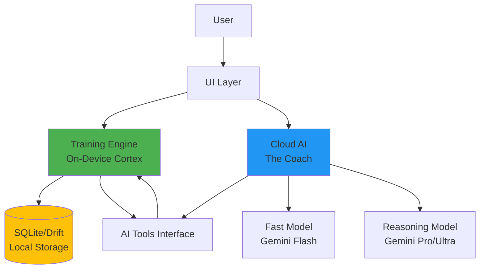
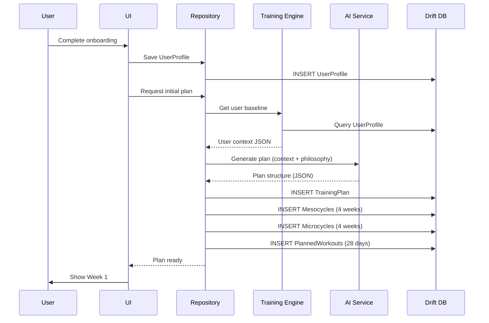
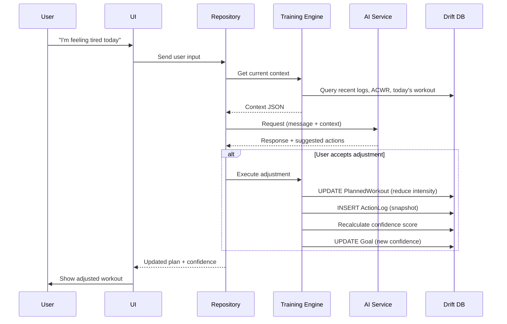
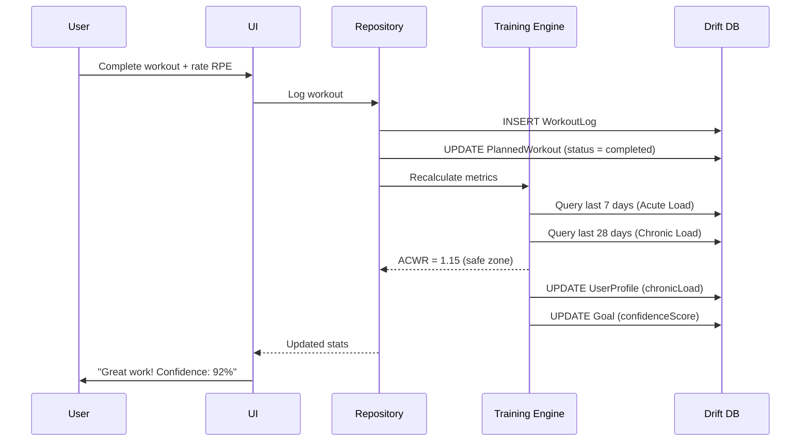
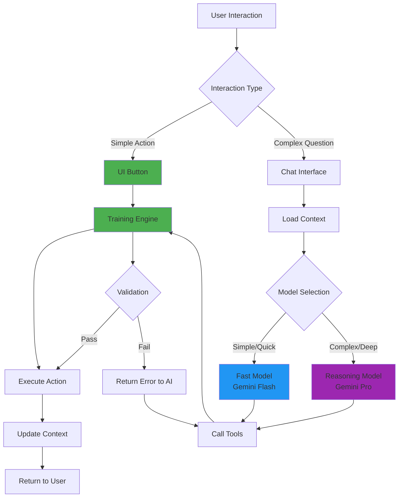

# Data Processing & AI Integration Plan

## Goal
Design a data processing strategy that prioritizes on-device calculation to minimize AI API costs, while ensuring long-term AI coherence and effective planning capabilities using an MCP-style tool approach.

## 1. Architecture Overview

### Hybrid Architecture: Local-First, Cloud-Augmented

### Core Architectural Decisions

#### 1. **UI-First Strategy**
- **Principle**: Prioritize explicit action buttons over chat to minimize AI calls
- **Example**: "Skip Day" button → Training Engine pushes workouts +1 day (no AI needed)
- **Benefit**: Faster UX, zero cost, deterministic outcomes
- **When to use Chat**: Complex negotiations, "Why?" questions, empathetic exploration

#### 2. **On-Device Training Engine ("The Cortex")**
- **Technology**: Pure Dart logic
- **Storage**: SQLite (Drift) or Hive
- **Responsibilities**:
  - Schedule management (moving workouts, detecting conflicts)
  - Quantifiable math (goal confidence, pace adjustments, volume ramp-up)
  - Simple rule-based adjustments
  - Validation logic for all AI tool calls
- **Execution Strategy**: Run calculations aggressively (on every app open or data modification) to ensure AI context is always fresh

#### 3. **Cloud AI ("The Coach")**
- **Tiered Model Strategy**:
  
  | Model Type | Use Cases | Latency | Cost |
  |------------|-----------|---------|------|
  | **Fast/Cheap** (Gemini Flash) | Daily motivation, simple explanations, quick check-ins | Low | Low |
  | **Reasoning/Complex** (Gemini Pro) | Major plan reworks, deep progress analysis, injury assessment | Medium | High |

- **Trigger Logic**: Use Reasoning model when user explicitly requests "Plan Rework" OR engine detects major failure state

#### 4. **Plan Lifecycle Management**
- **Pause**: For indeterminate breaks (vacation, illness) - stops the clock
- **Reset/Remake**: For restarts after long breaks or life events - redirects to onboarding flow to re-establish baseline without "baggage"

#### 5. **MCP-Style Tools Architecture**
- **Structure**: Strict tool definitions that AI can call (function calling or actual MCP server)
- **Validation**: Engine validates all tool calls before execution
- **Error Handling**: Returns structured errors to AI with explanations

---

## 2. Data Flow Patterns

### Onboarding → First Plan Generation

### Daily Check-In → Workout Adjustment

### Post-Workout Logging → Load Calculation

---

## 3. AI Integration Strategy

### System Prompt Structure

1. **Ash Personality**: Empathetic, knowledgeable, adaptive coach persona
2. **Context Window Management**: 3-tier memory system instructions
3. **Tool Calling Instructions**: When and how to use each tool
4. **Edge Case Handling**: Injury, motivation, weather, vacation protocols

### Conversation Flow Logic

### Token Budget Management

- **Cache context synthesis results** to avoid regenerating on every request
- **Optimize database queries** to minimize context generation time
- **Smart caching**: Reuse context if no data changes since last AI call
- **Minimize AI calls**: Use UI-first strategy to handle 80% of interactions deterministically
