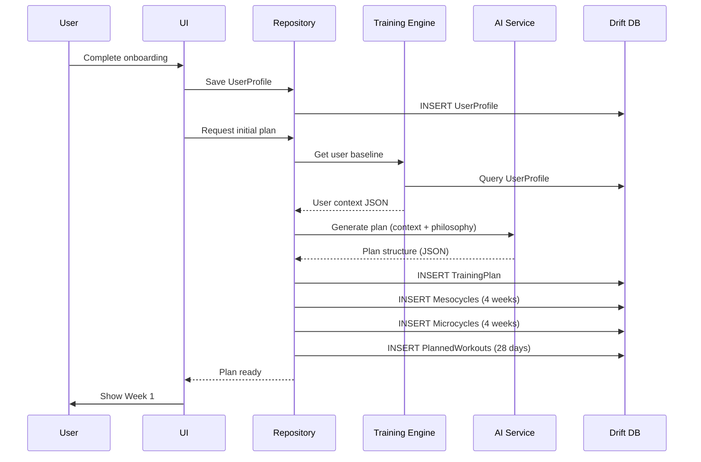

# Onboarding & Initial Plan Generation

> **Implements**: [Onboarding Flow](../../ux/product_spec/lifecycle/onboarding_flow.md)  
> **Data Models**: [User Profiles](../data_models/_index.md), [Goals](../data_models/_index.md), [Training Plans](../data_models/_index.md)  
> **Dependencies**: [Context Engine](../cross_cutting/context_engine.md), [Pillar Coordination](../cross_cutting/pillar_coordination.md)

**Purpose**: Calculate baseline fitness, validate user profile, and generate initial training plan.

## Baseline Fitness Calculation

### Input Data Collection
During onboarding, collect:
- **Activity Level**: Sedentary, Casual, Intermediate, Advanced
- **Current Running Frequency**: Days per week
- **Recent Long Run**: Distance (if applicable)
- **Recent Pace**: Comfortable running pace
- **Injury History**: Any chronic issues or recent injuries
- **Pillar Priorities**: Running, Strength, Mobility preferences

### Estimated VO2 Max Calculation

For users with recent running data:
```dart
double estimateVO2Max(double paceMinPerKm, double distance) {
  // Cooper formula approximation
  // VO2max = (distance in meters / time in minutes) - 133 * 0.172 + 33.3
  // Simplified for pace-based estimation
  return 65.0 - (paceMinPerKm * 2.5); // Rough approximation
}
```

For beginners without data:
- Sedentary: 30-35 ml/kg/min
- Casual: 35-42 ml/kg/min
- Intermediate: 42-50 ml/kg/min
- Advanced: 50+ ml/kg/min

## Initial Plan Generation Flow



## Validation Logic

### Profile Completeness Check
Ensure all required fields are present:
- Goal type and target
- Activity level
- Pillar priorities
- Any injury flags

### Safety Checks
- **Beginner Protection**: If activity level is "Sedentary" or "Casual", enforce conservative volume limits
- **Injury Awareness**: Flag any reported injuries for AI consideration during plan generation
- **Realistic Goals**: Validate that goal deadline allows sufficient training time

### Initial Volume Calculation

| Activity Level | Starting Weekly Volume (km) | Frequency (days/week) |
|----------------|------------------------------|----------------------|
| Sedentary | 5-10 | 2-3 |
| Casual | 10-20 | 3-4 |
| Intermediate | 20-35 | 4-5 |
| Advanced | 35-50+ | 5-6 |

## Related Tools

| Tool | Purpose | Called In |
|------|---------|-----------|
| `create_initial_plan` | Generate first training plan | Onboarding completion |
| `validate_user_profile` | Check profile completeness | Before plan generation |
| `estimate_baseline_fitness` | Calculate starting metrics | Profile creation |

## 🗄️ Data Models

| Entity | Schema Definition |
|--------|-------------------|
| User Profiles | [User Profiles](../data_models/_index.md) |
| Goals | [Goals](../data_models/_index.md) |
| Training Plans | [Training Plans](../data_models/_index.md) |
