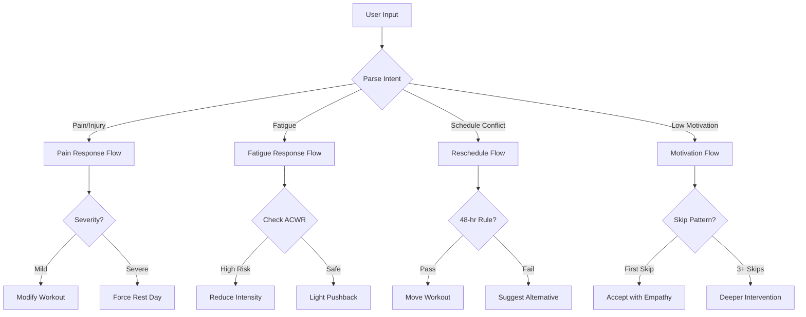

# Coaching & Daily Check-In Logic

> **Implements**: [Coaching & Communication](../../ux/product_spec/training/coaching.md)  
> **Data Models**: [Workouts](../data_models/_index.md), [Biomarkers](../data_models/_index.md)  
> **Dependencies**: [Context Engine](../cross_cutting/context_engine.md), [Load Management](../cross_cutting/load_mgmt.md)

**Purpose**: Implement daily check-in flow, adaptive coaching responses, and notification triggers.

## Daily Check-In Flow

### Morning Notification Trigger

```dart
bool shouldSendMorningNotification(User user, DateTime now) {
  // Learn user's optimal notification time
  TimeOfDay optimalTime = user.preferredNotificationTime ?? TimeOfDay(hour: 7, minute: 0);
  
  // Respect Do Not Disturb settings
  if (user.isInDoNotDisturb(now)) return false;
  
  // Check if user has a workout scheduled today
  bool hasWorkoutToday = user.hasPlannedWorkout(now);
  
  return hasWorkoutToday && now.hour == optimalTime.hour;
}
```

### Notification Content Generation

```dart
String generateDailyNotification({
  required PlannedWorkout workout,
  required WeatherForecast weather,
  required UserContext context,
}) {
  String workoutSummary = "${workout.type} - ${workout.duration} min";
  String motivationalMessage = getMotivationalMessage(context);
  
  // Weather-based advice
  if (weather.temperature > 32) {
    return "Good morning! $workoutSummary planned. It's hot today - hydrate well! 🌡️";
  } else if (weather.aqi > 150) {
    return "Heads up! Air quality is poor today. Consider moving your workout indoors. 💨";
  }
  
  return "Good morning! Here's what Ash has planned: $workoutSummary 🏃 $motivationalMessage";
}
```

## Adaptive Coaching Decision Tree

### User Input Processing



### Coaching Persona by Goal Type

| Goal Type | Tone | Example Response |
|-----------|------|------------------|
| `distance_milestone` | Encouraging, patient | "Consistency matters more than any single workout. Let's keep it easy today." |
| `time_performance` | Focused, science-based | "Intervals are key for speed, but recovery is vital. Let's modify this session." |
| `event` | Structured, deadline-aware | "This tempo is important for your race. Can we try a modified version?" |
| `maintenance` | Flexible, low-pressure | "Flexibility is the name of the game. Skip without guilt if needed." |

## Notification Strategy

### Milestone Notifications

| Trigger | Timing | Content |
|---------|--------|---------|
| Weekly Summary | Sunday 6pm | Progress recap, adherence %, confidence change |
| Achievement Unlock | Immediately after workout | "New PR! Fastest 5K: 24:32 🎉" |
| Goal Milestone | At 25%, 50%, 75% completion | "You're 50% through your training plan!" |
| Confidence Alert | When drops below 80% | "Your confidence dropped to 78%. Let's chat about your plan." |

### Adaptive Timing

```dart
TimeOfDay learnOptimalNotificationTime(List<WorkoutLog> logs) {
  // Analyze when user typically completes workouts
  Map<int, int> hourFrequency = {};
  
  for (var log in logs) {
    int hour = log.startTime.hour;
    hourFrequency[hour] = (hourFrequency[hour] ?? 0) + 1;
  }
  
  // Find most common workout start time
  int mostCommonHour = hourFrequency.entries
      .reduce((a, b) => a.value > b.value ? a : b)
      .key;
  
  // Send notification 30 minutes before typical workout time
  return TimeOfDay(hour: (mostCommonHour - 1).clamp(6, 21), minute: 30);
}
```

## AI Coaching Intelligence

### Personalization Factors

The AI considers:
- **Training History**: Past workouts and performance trends
- **User Feedback**: Responses to daily check-ins and workout logs
- **Physiological Data**: Heart rate, pace, RPE patterns
- **Environmental Factors**: Weather, terrain, location
- **Life Context**: Work schedule, stress levels, sleep quality
- **Behavioral Patterns**: Skip patterns, motivation trends

### Pattern-Aware Coaching

```dart
String generateCoachingResponse({
  required String userMessage,
  required UserContext context,
  required List<WorkoutLog> recentLogs,
}) {
  // Detect skip pattern
  if (hasSkipPattern(recentLogs)) {
    return "I've noticed you've skipped a few workouts lately. "
           "Is something feeling off? Let's adjust your plan if needed.";
  }
  
  // Detect overtraining signals
  if (context.acwr > 1.4 && context.recentBiomarkers.motivation < 5) {
    return "Your body might be telling you something. "
           "Let's take a recovery week to recharge.";
  }
  
  // Default empathetic response
  return generateEmpathetic Response(userMessage, context);
}
```

## Related Tools

| Tool | Purpose | Called In |
|------|---------|-----------|
| `send_daily_notification` | Trigger morning check-in | Background scheduler |
| `generate_coaching_response` | AI response generation | Chat interface |
| `learn_notification_timing` | Optimize notification time | Background analysis |

## 🗄️ Data Models

| Entity | Schema Definition |
|--------|-------------------|
| Workouts | [Workouts](../data_models/_index.md) |
| Biomarkers | [Biomarkers](../data_models/_index.md) |
