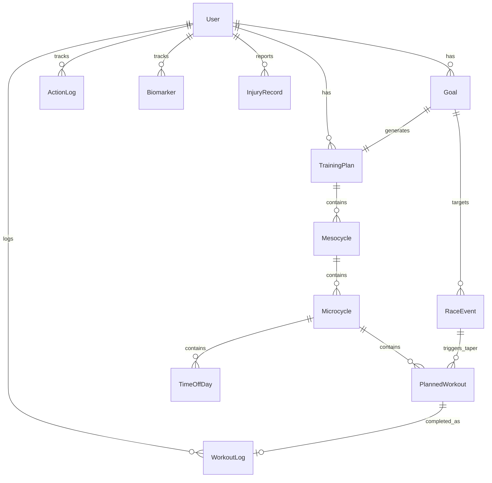
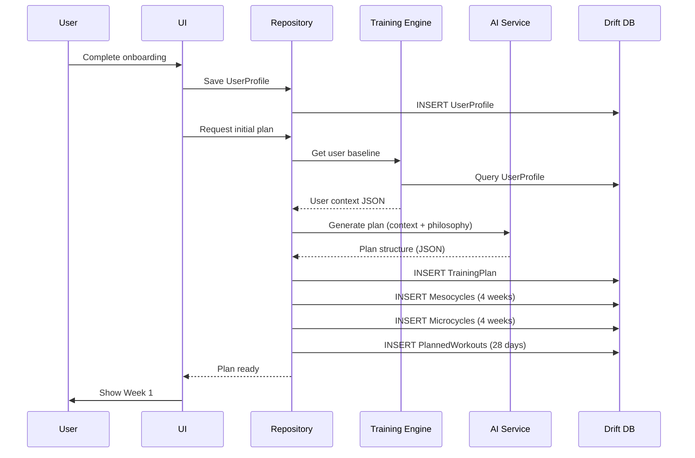
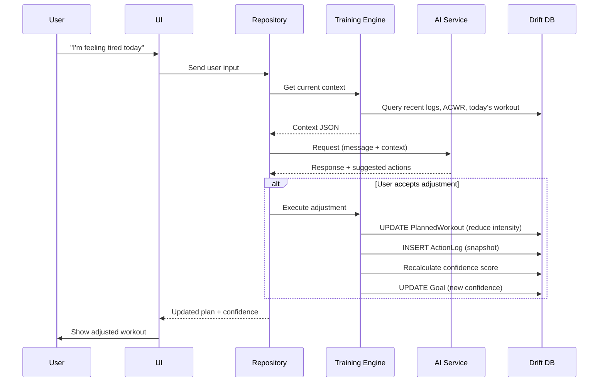
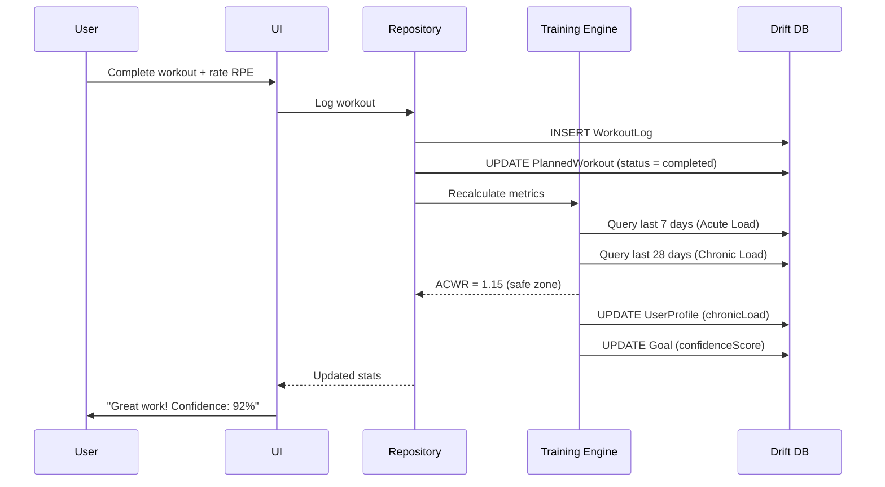

# Data Models & Schema

This document defines the core data structures, database schema, and relationships for the Ash Trainer app.

## 1. Technology Stack

**Database:** Drift (SQLite wrapper for Flutter)
- **Why?** Type-safe, reactive streams, offline-first, excellent for complex queries
- **Location:** Local device storage (primary), optional cloud backup

**Key-Value Store:** Shared Preferences
- **Why?** Simple flags and settings (onboarding status, theme, notification preferences)

---

## 2. Core Entities Overview



---

## 3. Entity Definitions

### 3.1 User Profile

Stores user identity, preferences, and current fitness baseline.

```dart
@DataClassName('UserProfile')
class UserProfiles extends Table {
  IntColumn get id => integer().autoIncrement()();
  
  // Identity
  TextColumn get name => text().withLength(min: 1, max: 100)();
  TextColumn get email => text().nullable()();
  
  // Biometric Data
  IntColumn get age => integer().nullable()();
  RealColumn get heightCm => real().nullable()();
  RealColumn get weightKg => real().nullable()();
  
  // Onboarding Data
  TextColumn get activityLevel => text()(); // 'beginner', 'casual', 'regular', 'very_active'
  TextColumn get primaryGoalType => text()(); // 'distance', 'performance', 'maintenance', 'event'
  
  // Pillar Priorities (Flexible JSON structure)
  TextColumn get pillarPriorities => text(); // JSON: {"running": "high", "strength": "medium", "mobility": "low"}
  
  // Training Availability
  IntColumn get daysPerWeek => integer().withDefault(const Constant(4))();
  TextColumn get preferredRestDays => text().nullable()(); // JSON array: ["Sunday"]
  
  // Equipment Access
  TextColumn get equipmentAccess => text()(); // JSON array: ["gym", "dumbbells", "bodyweight"]
  
  // Limitations
  TextColumn get injuries => text().nullable()(); // JSON array of injury objects
  TextColumn get movementRestrictions => text().nullable()(); // JSON array: ["no_overhead_press"]
  
  // Calculated Baselines (updated by Training Engine)
  RealColumn get chronicLoad => real().withDefault(const Constant(0.0))(); // 4-week average load
  RealColumn get acuteLoad => real().withDefault(const Constant(0.0))(); // 7-day load
  RealColumn get currentACWR => real().withDefault(const Constant(0.0))(); // Acute:Chronic ratio
  RealColumn get estimatedVO2Max => real().nullable()();
  RealColumn get maxHeartRate => real().nullable()();
  
  // Metadata
  DateTimeColumn get createdAt => dateTime().withDefault(currentDateAndTime)();
  DateTimeColumn get updatedAt => dateTime().withDefault(currentDateAndTime)();
}
```

**Biometric Data Usage:**
- **Age**: Max heart rate calculation (220 - age), age-graded performance
- **Height**: Stride length estimates, body composition context
- **Weight**: Calorie burn estimation, power-to-weight ratios

**Pillar Priorities JSON Example:**
```json
{
  "running": "high",
  "strength": "medium",
  "mobility": "low"
}
```

> [!NOTE]
> Pillar priorities use a flexible JSON structure to allow adding new training pillars (yoga, etc.) without schema changes. **Cycling and swimming are NOT regular pillars**—they are only used as low-impact alternatives during injury recovery (see training_philosophy.md).

**ACWR (Acute:Chronic Workload Ratio) Calculation:**

The Training Engine recalculates ACWR after every workout log:

```dart
// Acute Load: Sum of session loads from last 7 days
acuteLoad = workoutLogs.where(date >= today - 7 days).sum(sessionLoad)

// Chronic Load: Average weekly load over last 28 days
chronicLoad = workoutLogs.where(date >= today - 28 days).sum(sessionLoad) / 4

// ACWR: Acute ÷ Chronic ratio
currentACWR = acuteLoad / chronicLoad
```

**ACWR Zones (Default):**
- **< 0.8**: Undertraining - can increase volume
- **0.8 - 1.3**: Safe Zone - maintain or progress gradually
- **> 1.3**: High Risk - deload immediately

> [!NOTE]
> ACWR thresholds vary by goal type. See **Goal Type Configuration Reference** in Section 3.2 for goal-specific ranges (e.g., Maintenance uses 0.7-1.0, Event allows up to 1.4 during peak phases).

**Key Relationships:**
- One user → Many goals
- One user → Many training plans
- One user → Many workout logs

---

### 3.2 Goal

Represents a user's training objective (e.g., "Run a marathon in 16 weeks").

```dart
@DataClassName('Goal')
class Goals extends Table {
  IntColumn get id => integer().autoIncrement()();
  IntColumn get userId => integer().references(UserProfiles, #id)();
  
  // Goal Definition
  TextColumn get goalType => text()(); // 'distance_milestone', 'time_performance', 'maintenance', 'event'
  TextColumn get targetDescription => text()(); // "Complete first 10K", "Sub-30 5K"
  
  // Target Metrics
  RealColumn get targetDistance => real().nullable()(); // in km
  IntColumn get targetTimeSeconds => integer().nullable()(); // for time-based goals
  
  // Timeline
  DateTimeColumn get startDate => dateTime()();
  DateTimeColumn get targetDate => dateTime().nullable()(); // null = "as soon as possible"
  DateTimeColumn get completedAt => dateTime().nullable()();
  
  // Status
  TextColumn get status => text().withDefault(const Constant('active'))(); // 'active', 'paused', 'completed', 'abandoned'
  RealColumn get confidenceScore => real().withDefault(const Constant(100.0))(); // 0-100%
  
  // Metadata
  DateTimeColumn get createdAt => dateTime().withDefault(currentDateAndTime)();
  DateTimeColumn get updatedAt => dateTime().withDefault(currentDateAndTime)();
}
```

**Goal Type Configuration Reference:**

Each goal type determines key training parameters. The Training Engine applies these configurations automatically based on `goalType`:

| Goal Type | Intensity Model | Workout Prescription | ACWR Safe Range | Taper Duration |
|-----------|-----------------|---------------------|-----------------|----------------|
| `distance_milestone` | Pyramidal (75/20/5) | Time-based | 0.8 - 1.2 | 7-10 days |
| `time_performance` | Polarized (80/0/20) | Distance-based | 0.8 - 1.3 | 1-2 weeks |
| `event` | Phase-based (varies) | Mixed | 0.9 - 1.4 | 1-3 weeks (by race distance) |
| `maintenance` | Flat (85/5/10) | Flexible | 0.7 - 1.0 | None |

**Intensity Model Breakdown (Easy/Moderate/High):**
- **Pyramidal:** 75% easy, 20% moderate, 5% high (beginners, distance milestones)
- **Polarized:** 80% easy, 0% moderate, 20% high (performance-focused)
- **Phase-based:** Varies by phase (base → build → peak → taper)
- **Flat:** 85% easy, 5% moderate, 10% high (maintenance mode)

**Workout Prescription Styles:**
- **Time-based:** Workouts prescribed by duration (e.g., "run for 30 minutes")
- **Distance-based:** Key workouts prescribed by distance (e.g., "6 × 400m intervals")
- **Flexible:** Either style, user preference

**Missed Workout Protocols by Goal Type:**
- **Distance Milestone:** Skip and move on, never make up
- **Time Performance:** Reschedule key workouts within 48 hours if fresh
- **Event:** Attempt shortened versions in build/peak phases
- **Maintenance:** All workouts flexible, skip without penalty

**Confidence Score Calculation:**
Computed by the Training Engine based on:
- Workout adherence (completed vs. planned)
- Workout quality (hitting RPE/pace targets)
- Consistency (training frequency)
- Time remaining vs. progress
- Recent performance trends

---

### 3.3 Race Event

Tracks races and athletic events on the calendar.

> [!NOTE]
> **Goal Relationship:** A `Goal` can have multiple `RaceEvents` (e.g., tune-up races leading to a goal race). The `goalId` field links a race to its associated goal. If `goalId` is null, it's a standalone event (fun run, non-running event).

```dart
@DataClassName('RaceEvent')
class RaceEvents extends Table {
  IntColumn get id => integer().autoIncrement()();
  IntColumn get goalId => integer().references(Goals, #id).nullable()(); // null for non-goal races
  IntColumn get userId => integer().references(UserProfiles, #id)();
  
  // Event Details
  TextColumn get eventName => text()();
  TextColumn get eventType => text()(); // 'goal_race', 'tune_up', 'fun_run', 'non_running'
  DateTimeColumn get eventDate => dateTime()();
  
  // Race Specifics
  RealColumn get distance => real().nullable()(); // in km
  TextColumn get raceDistance => text().nullable()(); // '5K', '10K', 'Half', 'Marathon'
  TextColumn get location => text().nullable()();
  TextColumn get notes => text().nullable()(); // "Hilly course, 7am start"
  
  // Goals
  IntColumn get goalTimeSeconds => integer().nullable()();
  RealColumn get goalPacePerKm => real().nullable()();
  
  // Taper Management
  DateTimeColumn get taperStartDate => dateTime().nullable()(); // Auto-calculated based on race distance
  IntColumn get taperDurationDays => integer().nullable()(); // 7-21 days depending on distance
  
  // Results (filled after race)
  IntColumn get actualTimeSeconds => integer().nullable()();
  RealColumn get actualPacePerKm => real().nullable()();
  IntColumn get effortRPE => integer().nullable()(); // 1-10
  
  // Metadata
  DateTimeColumn get createdAt => dateTime().withDefault(currentDateAndTime)();
}
```

---

### 3.4 Training Plan

A high-level container for a user's training program (typically 4-16 weeks).

> [!IMPORTANT]
> **Goal Relationship:** While the schema allows multiple plans per goal (for versioning and history), the application enforces **only one active plan per goal** at any time. The `status` field distinguishes between active, paused, and completed plans.

```dart
@DataClassName('TrainingPlan')
class TrainingPlans extends Table {
  IntColumn get id => integer().autoIncrement()();
  IntColumn get userId => integer().references(UserProfiles, #id)();
  IntColumn get goalId => integer().references(Goals, #id).nullable()();
  
  // Plan Structure
  TextColumn get planName => text()(); // "Marathon Base Building", "10K Speed Work"
  TextColumn get periodizationModel => text()(); // 'pyramidal', 'polarized' (auto-selected based on volume: <30km/week = pyramidal, >40km/week = polarized)
  TextColumn get currentPhase => text()(); // 'base', 'build', 'peak', 'taper', 'maintenance'
  
  // Timeline
  DateTimeColumn get startDate => dateTime()();
  DateTimeColumn get endDate => dateTime()();
  IntColumn get totalWeeks => integer()();
  IntColumn get currentWeek => integer().withDefault(const Constant(1))();
  
  // Status
  TextColumn get status => text().withDefault(const Constant('active'))(); // 'active', 'paused', 'completed'
  
  // AI Generation Context (for regeneration)
  TextColumn get generationPrompt => text().nullable()(); // Original AI prompt used
  TextColumn get aiModelUsed => text().nullable()(); // 'gemini-flash-2.0'
  
  // Metadata
  DateTimeColumn get createdAt => dateTime().withDefault(currentDateAndTime)();
  DateTimeColumn get updatedAt => dateTime().withDefault(currentDateAndTime)();
}
```

---

### 3.5 Mesocycle

A 4-week training block within a plan.

```dart
@DataClassName('Mesocycle')
class Mesocycles extends Table {
  IntColumn get id => integer().autoIncrement()();
  IntColumn get planId => integer().references(TrainingPlans, #id)();
  
  // Structure
  IntColumn get weekNumber => integer()(); // 1-4 within the mesocycle
  TextColumn get focusType => text()(); // 'base_volume', 'progression', 'peak', 'recovery'
  
  // Volume Targets
  RealColumn get targetWeeklyDistance => real()(); // in km
  IntColumn get targetSessionCount => integer()();
  RealColumn get volumeAdjustmentFactor => real().withDefault(const Constant(1.0))(); // 1.0 = normal, 0.7 = recovery week
  
  // Dates
  DateTimeColumn get startDate => dateTime()();
  DateTimeColumn get endDate => dateTime()();
  
  // Metadata
  DateTimeColumn get createdAt => dateTime().withDefault(currentDateAndTime)();
}
```

---

### 3.6 Microcycle (Week)

A single week of training within a mesocycle.

```dart
@DataClassName('Microcycle')
class Microcycles extends Table {
  IntColumn get id => integer().autoIncrement()();
  IntColumn get mesocycleId => integer().references(Mesocycles, #id)();
  
  // Structure
  IntColumn get weekNumber => integer()(); // Global week number in plan
  DateTimeColumn get startDate => dateTime()();
  DateTimeColumn get endDate => dateTime()();
  
  // Weekly Metrics (calculated)
  RealColumn get plannedDistance => real()();
  RealColumn get actualDistance => real().withDefault(const Constant(0.0))();
  RealColumn get adherenceRate => real().withDefault(const Constant(0.0))(); // 0-100%
  
  // Load Tracking
  RealColumn get plannedLoad => real()(); // Sum of planned session loads
  RealColumn get actualLoad => real().withDefault(const Constant(0.0))(); // Sum of logged session loads
  
  // Metadata
  DateTimeColumn get createdAt => dateTime().withDefault(currentDateAndTime)();
}
```

---

### 3.7 Planned Workout

A single scheduled training session.

```dart
@DataClassName('PlannedWorkout')
class PlannedWorkouts extends Table {
  IntColumn get id => integer().autoIncrement()();
  IntColumn get microcycleId => integer().references(Microcycles, #id)();
  
  // Scheduling
  DateTimeColumn get scheduledDate => dateTime()();
  IntColumn get dayOfWeek => integer()(); // 1=Monday, 7=Sunday
  BoolColumn get isKeySession => boolean().withDefault(const Constant(false))(); // High priority
  BoolColumn get isAdHoc => boolean().withDefault(const Constant(false))(); // Ad-hoc workout (e.g., during time off)
  
  // Workout Type
  TextColumn get pillar => text()(); // 'running', 'strength', 'mobility'
  TextColumn get workoutType => text()(); // 'easy_run', 'tempo', 'intervals', 'long_run', 'full_body', 'upper_lower'
  TextColumn get sessionName => text()(); // "Easy Aerobic Run", "Interval Session"
  
  // Prescription
  IntColumn get targetDurationMinutes => integer().nullable()();
  RealColumn get targetDistanceKm => real().nullable()();
  IntColumn get targetRPE => integer().nullable()(); // 1-10
  TextColumn get intensityZone => text().nullable()(); // 'easy', 'moderate', 'threshold', 'vo2max'
  
  // Detailed Instructions (JSON)
  TextColumn get workoutStructure => text().nullable()(); // JSON: intervals, sets, reps
  TextColumn get coachingNotes => text().nullable()(); // "Focus on form, keep it conversational"
  
  // Status
  TextColumn get status => text().withDefault(const Constant('planned'))(); // 'planned', 'completed', 'skipped', 'rescheduled'
  IntColumn get completedAsLogId => integer().references(WorkoutLogs, #id).nullable()();
  
  // Metadata
  DateTimeColumn get createdAt => dateTime().withDefault(currentDateAndTime)();
  DateTimeColumn get updatedAt => dateTime().withDefault(currentDateAndTime)();
}

> [!NOTE]
> **isAdHoc Flag:** Marks workouts created on-demand during time-off periods. These are still added to the current microcycle but don't affect adherence metrics or goal confidence.

**Workout Structure JSON Example (Intervals):**
```json
{
  "warmup": { "duration_min": 10, "rpe": 3 },
  "intervals": [
    { "duration_min": 4, "rpe": 9, "recovery_min": 2 }
  ],
  "repeat": 5,
  "cooldown": { "duration_min": 10, "rpe": 3 }
}
```

---

### 3.8 Time-Off Day

Tracks individual days when the user has scheduled time off. Supports partial weeks and cross-week time-off periods.

```dart
@DataClassName('TimeOffDay')
class TimeOffDays extends Table {
  IntColumn get id => integer().autoIncrement()();
  IntColumn get microcycleId => integer().references(Microcycles, #id)();
  
  // Time-Off Period
  DateTimeColumn get date => dateTime()(); // Specific date that's time off
  TextColumn get notes => text().nullable()(); // "Beach vacation", "Work conference", "Finals week"
  
  // Metadata
  DateTimeColumn get createdAt => dateTime().withDefault(currentDateAndTime)();
}
```

> [!NOTE]
> **Granular Time-Off Tracking:** This table allows for flexible time-off scheduling:
> - **Partial Weeks**: "Thursday-Sunday long weekend" = 4 TimeOffDay records
> - **Full Weeks**: "1-week vacation" = 7 TimeOffDay records
> - **Cross-Week Periods**: "10-day trip" spans 2 microcycles naturally
> - **Ad-Hoc Workouts**: User can still create PlannedWorkout (with isAdHoc=true) on time-off days
> 
> **Application Logic:**
> - When scheduling time off, create TimeOffDay records for each date
> - Delete any existing PlannedWorkouts for those dates
> - Calendar shows "Time Off" badge instead of empty day
> - Goal confidence calculations skip time-off days (no penalty)

---

### 3.9 Workout Log

Records a completed training session with actual performance data.

```dart
@DataClassName('WorkoutLog')
class WorkoutLogs extends Table {
  IntColumn get id => integer().autoIncrement()();
  IntColumn get plannedWorkoutId => integer().references(PlannedWorkouts, #id)();
  
  // Timing
  DateTimeColumn get startTime => dateTime()();
  DateTimeColumn get endTime => dateTime()();
  IntColumn get durationMinutes => integer()();
  
  // Workout Details
  TextColumn get pillar => text()(); // 'running', 'strength', 'mobility', 'yoga', etc.
  TextColumn get workoutType => text()();
  
  // Subjective Metrics (Universal)
  IntColumn get rpe => integer()(); // 1-10 (required)
  RealColumn get sessionLoad => real()(); // RPE × Duration
  
  // Pillar-Specific Data (JSON)
  TextColumn get pillarData => text()(); // JSON: structure varies by pillar type
  
  // Health Connect Integration
  TextColumn get healthConnectRecordId => text().nullable()();
  TextColumn get sourceApp => text().nullable()(); // 'suunto', 'strava', 'manual'
  
  // Notes
  TextColumn get userNotes => text().nullable()();
  TextColumn get painReported => text().nullable()(); // JSON: [{"location": "knee", "severity": 3}]
  
  // Metadata
  DateTimeColumn get createdAt => dateTime().withDefault(currentDateAndTime)();
}
```

**Session Load Calculation:**
```
Session Load = RPE × Duration (minutes)
Example: 7 RPE × 60 min = 420 AU
```

**Pillar Data JSON Structure:**

The `pillarData` field stores pillar-specific metrics in JSON format. Structure varies by workout type:

**Running:**
```json
{
  "distanceKm": 5.2,
  "avgPacePerKm": 330,
  "avgHeartRate": 145,
  "maxHeartRate": 165,
  "elevationGainMeters": 120,
  "splits": [
    {"km": 1, "pacePerKm": 325},
    {"km": 2, "pacePerKm": 335}
  ]
}
```

**Strength:**
```json
{
  "exercises": [
    {
      "name": "Back Squat",
      "movementPattern": "squat",
      "sets": [
        {"reps": 10, "weightKg": 60, "rir": 2},
        {"reps": 8, "weightKg": 65, "rir": 1}
      ]
    },
    {
      "name": "Bench Press",
      "movementPattern": "push",
      "sets": [
        {"reps": 8, "weightKg": 50, "rir": 2}
      ]
    }
  ]
}
```

**Mobility/Yoga:**
```json
{
  "poses": ["Downward Dog", "Warrior II", "Child's Pose", "Pigeon"],
  "focusAreas": ["hips", "shoulders", "hamstrings"],
  "breathwork": true,
  "meditationMinutes": 5
}
```

**Cycling (Future):**
```json
{
  "distanceKm": 25.0,
  "avgPowerWatts": 180,
  "avgCadence": 85,
  "avgHeartRate": 140,
  "elevationGainMeters": 300
}
```

> [!NOTE]
> **Flexibility**: The JSON structure allows adding new pillars (swimming, hiking, etc.) without schema migrations. Dart models can deserialize `pillarData` into type-safe classes based on the `pillar` field.

---

### 3.10 Biomarker

Tracks subjective health metrics (energy, sleep quality, stress, motivation).

> [!NOTE]
> **Pain is tracked separately**: All pain and injury tracking is handled by `InjuryRecords`. Biomarkers are for general health indicators that affect training readiness.

```dart
@DataClassName('Biomarker')
class Biomarkers extends Table {
  IntColumn get id => integer().autoIncrement()();
  IntColumn get userId => integer().references(UserProfiles, #id)();
  
  // Type
  TextColumn get biomarkerType => text()(); // 'energy', 'sleep_quality', 'stress', 'motivation'
  
  // Value
  IntColumn get value => integer()(); // 1-10 scale
  TextColumn get reason => text().nullable()(); // For motivation: 'tired', 'stressed', 'not_feeling_it', 'excited'
  TextColumn get notes => text().nullable()();
  
  // Context
  DateTimeColumn get recordedAt => dateTime()();
  IntColumn get relatedWorkoutId => integer().references(WorkoutLogs, #id).nullable()();
  
  // Metadata
  DateTimeColumn get createdAt => dateTime().withDefault(currentDateAndTime)();
}
```

**Motivation Pattern Detection:**

When `biomarkerType = 'motivation'`, the Training Engine analyzes these logs to detect:
- **Skip Patterns**: 3+ skips in 2 weeks triggers intervention
- **Low Motivation Streaks**: 3+ consecutive days with value < 5
- **Burnout Indicators**: Declining motivation trend over 2+ weeks

**Example Query:**
```dart
// Get recent motivation logs
final motivationLogs = await (select(biomarkers)
  ..where((b) => b.biomarkerType.equals('motivation'))
  ..orderBy([(b) => OrderingTerm.desc(b.recordedAt)])
  ..limit(14)
).get();
```

---

### 3.11 Injury Record

Tracks all pain and injuries, from minor soreness to major issues, with lifecycle management.

> [!NOTE]
> **Handles all pain tracking**: This table tracks everything from transient soreness ("knee felt tight after run") to diagnosed injuries ("shin splints"). Minor issues can be quickly resolved, while persistent injuries are tracked long-term.

```dart
@DataClassName('InjuryRecord')
class InjuryRecords extends Table {
  IntColumn get id => integer().autoIncrement()();
  IntColumn get userId => integer().references(UserProfiles, #id)();
  
  // Injury Details
  TextColumn get injuryType => text()(); // 'soreness', 'tightness', 'knee_pain', 'shin_splints', 'it_band'
  TextColumn get location => text()(); // 'left_knee', 'right_ankle', 'hamstring'
  IntColumn get severityLevel => integer()(); // 1-10
  
  // Timeline
  DateTimeColumn get firstReportedAt => dateTime()();
  DateTimeColumn get lastReportedAt => dateTime()(); // Updated each time user reports
  DateTimeColumn get resolvedAt => dateTime().nullable()();
  TextColumn get status => text().withDefault(const Constant('active'))(); // 'active', 'recovering', 'resolved'
  
  // Impact
  TextColumn get affectedMovements => text().nullable()(); // JSON: ["running", "squats"]
  TextColumn get recommendedAlternatives => text().nullable()(); // JSON: ["cycling", "swimming"]
  
  // Context
  IntColumn get relatedWorkoutId => integer().references(WorkoutLogs, #id).nullable()(); // Workout that triggered initial report
  
  // Notes
  TextColumn get userNotes => text().nullable()();
  TextColumn get medicalAdvice => text().nullable()(); // From doctor/PT
  
  // Metadata
  DateTimeColumn get createdAt => dateTime().withDefault(currentDateAndTime)();
  DateTimeColumn get updatedAt => dateTime().withDefault(currentDateAndTime)();
}
```

**Lifecycle Examples:**

**Minor Soreness (Quick Resolution):**
```dart
// Day 1: Report soreness
InjuryRecord(
  injuryType: 'soreness',
  location: 'knee',
  severityLevel: 3,
  status: 'active'
)

// Day 3: Auto-resolved (no reports for 3 days)
status = 'resolved'
resolvedAt = DateTime.now()
```

**Persistent Injury (Long-term Tracking):**
```dart
// Week 1: Initial report
InjuryRecord(
  injuryType: 'shin_splints',
  location: 'left_shin',
  severityLevel: 6,
  status: 'active',
  affectedMovements: ['running']
)

// Week 2: Still present but improving
severityLevel = 4
status = 'recovering'
lastReportedAt = DateTime.now()

// Week 4: Resolved
status = 'resolved'
resolvedAt = DateTime.now()
```

---

### 3.12 Action Log

Tracks all AI actions with snapshot-based undo support.

> [!NOTE]
> **Time-Limited Undo**: Users can undo AI actions within a short time window (30 seconds for minor changes, 5 minutes for major changes). This prevents conflicts from later modifications while handling immediate regret scenarios.

```dart
@DataClassName('ActionLog')
class ActionLogs extends Table {
  IntColumn get id => integer().autoIncrement()();
  IntColumn get userId => integer().references(UserProfiles, #id)();
  
  // Action Details
  TextColumn get actionType => text()(); // 'reschedule_workout', 'adjust_intensity', 'create_injury', 'adjust_goal'
  TextColumn get impact => text()(); // 'minor', 'major'
  TextColumn get triggeredBy => text()(); // 'ai', 'user', 'system'
  TextColumn get reason => text().nullable()(); // "User reported knee pain"
  
  // Snapshot (JSON)
  TextColumn get beforeState => text()(); // JSON snapshot of affected records before change
  TextColumn get afterState => text()(); // JSON snapshot after change
  TextColumn get affectedRecords => text()(); // JSON: [{"table": "PlannedWorkouts", "ids": [1,2,3]}]
  
  // Undo Support
  DateTimeColumn get undoExpiresAt => dateTime()(); // createdAt + (30s for minor, 5min for major)
  BoolColumn get wasUndone => boolean().withDefault(const Constant(false))();
  DateTimeColumn get undoneAt => dateTime().nullable()();
  
  // Metadata
  DateTimeColumn get createdAt => dateTime().withDefault(currentDateAndTime)();
}
```

**Undo Time Windows:**
- **Minor actions** (adjust intensity, swap workout type): 30 seconds
- **Major actions** (reschedule week, adjust goal, create injury): 5 minutes

**Example Usage:**

```dart
// Log action with snapshot
final log = ActionLog(
  actionType: 'reschedule_workouts',
  impact: 'major',
  triggeredBy: 'ai',
  reason: 'User scheduled vacation',
  beforeState: jsonEncode({
    'workouts': [
      {'id': 1, 'date': '2024-01-15', 'type': 'tempo'},
      {'id': 2, 'date': '2024-01-16', 'type': 'long_run'}
    ]
  }),
  afterState: jsonEncode({
    'workouts': [] // Cleared for vacation
  }),
  affectedRecords: jsonEncode([
    {'table': 'PlannedWorkouts', 'ids': [1, 2]}
  ]),
  undoExpiresAt: DateTime.now().add(Duration(minutes: 5))
);

// Undo within time window
if (DateTime.now().isBefore(log.undoExpiresAt) && !log.wasUndone) {
  await restoreFromSnapshot(log.beforeState, log.affectedRecords);
  log.wasUndone = true;
  log.undoneAt = DateTime.now();
}
```

---

### 3.13 Performance Snapshot

Stores periodic snapshots of performance metrics for plateau detection.

```dart
@DataClassName('PerformanceSnapshot')
class PerformanceSnapshots extends Table {
  IntColumn get id => integer().autoIncrement()();
  IntColumn get userId => integer().references(UserProfiles, #id)();
  
  // Snapshot Details
  DateTimeColumn get snapshotDate => dateTime()();
  TextColumn get pillar => text()(); // 'running', 'strength', 'mobility'
  
  // Performance Metrics
  RealColumn get keyMetric => real()(); // Pace for running, weight for strength, etc.
  TextColumn get metricType => text()(); // 'avg_pace_5k', 'squat_1rm', 'flexibility_score'
  IntColumn get sampleSize => integer().withDefault(const Constant(1))(); // Number of workouts used to calculate this metric
  TextColumn get metricContext => text().nullable()(); // JSON: {"distance": "5K", "conditions": "flat_course", "avgHeartRate": 165}
  
  // Trend Analysis
  RealColumn get changeFromPrevious => real().nullable()(); // % change from last snapshot
  TextColumn get trendStatus => text()(); // 'improving', 'plateau', 'declining'
  
  // Metadata
  DateTimeColumn get createdAt => dateTime().withDefault(currentDateAndTime)();
}
```

**Plateau Detection Logic:**
- Snapshots taken every 2-3 weeks
- Plateau = < 2% improvement over 3 consecutive snapshots
- Triggers intervention protocols (deload, variation, volume block)

---

---

## 4. Context Architecture: Three-Tier Memory System

The Training Engine synthesizes data from all tables into a three-tier context structure for AI interactions:

### 4.1 Long-Term Context (> 1 month ago)

**Purpose:** High-level journey summary for big picture consistency

**Data Sources:**
- `Goals`: Goal type, target, chronic patterns
- `InjuryRecords`: Recurring injury history
- `RaceEvents`: Historical race results, race frequency patterns
- `UserProfiles`: Pillar priorities, baseline fitness
- `WorkoutLogs`: Overall adherence patterns (aggregated)

**Example Output:**
```json
{
  "goal": {
    "type": "event",
    "target": "Marathon - Sub 4:00:00",
    "deadline": "2024-10-12",
    "weeks_elapsed": 8,
    "weeks_remaining": 8
  },
  "user_baseline": {
    "activity_level": "casual",
    "pillar_priorities": { "running": "high", "strength": "medium", "mobility": "low" },
    "estimated_vo2_max": 42.5
  },
  "adherence_patterns": {
    "overall_completion_rate": 0.72,
    "running_completion_rate": 0.85,
    "strength_completion_rate": 0.45,
    "mobility_completion_rate": 0.80,
    "avg_weekly_volume_km": 35.2,
    "volume_progression_rate": 0.15
  },
  "injury_history": [
    {
      "type": "knee_pain",
      "location": "left_knee",
      "first_reported": "2024-06-15",
      "resolved_at": "2024-07-20",
      "notes": "Responds well to unilateral work and mobility focus"
    }
  ],
  "race_history": [
    { "date": "2024-08-15", "distance": "5K", "time_seconds": 1335, "is_pr": true },
    { "date": "2024-09-10", "distance": "10K", "time_seconds": 2790 },
    { "date": "2024-10-01", "distance": "Half", "time_seconds": 6120 }
  ]
}
```

---

### 4.2 Medium-Term Context (7-30 days ago)

**Purpose:** Recent trends and deviations to contextualize current performance

**Data Sources:**
- `WorkoutLogs`: Recent adherence patterns, session loads for ACWR calculation
- `Biomarkers`: Energy/sleep/stress/motivation patterns
- `RaceEvents`: Recent races (last 30 days) for recovery assessment
- `TimeOffDays`: Recent time-off days
- `TrainingPlan` / `Mesocycles`: Recent phase transitions, mesocycle progression
- `UserProfiles`: Current ACWR (calculated from WorkoutLogs)

**Example Output:**
```json
{
  "adherence_last_30_days": {
    "completion_rate": 0.70,
    "running_completion_rate": 0.65,
    "missed_workouts": 9,
    "deviation_from_average": -0.15
  },
  "load_management": {
    "acute_load": 2800,
    "chronic_load": 2240,
    "acwr": 1.25,
    "injury_risk": "moderate",
    "trend": "increasing"
  },
  "active_injuries": [
    {
      "id": 42,
      "type": "soreness",
      "location": "left_knee",
      "severity": 3,
      "status": "active",
      "first_reported": "2024-12-23",
      "last_reported": "2024-12-28",
      "days_since_report": 5
    }
  ],
  "biomarker_trends": {
    "energy_avg": 6.2,
    "sleep_quality_avg": 5.8,
    "stress_avg": 6.5,
    "motivation_avg": 4.1,
    "motivation_trend": "declining"
  },
  "recent_events": [
    {
      "type": "time_off",
      "start_date": "2024-12-01",
      "end_date": "2024-12-05",
      "notes": "Vacation"
    },
    {
      "type": "race",
      "date": "2024-11-28",
      "distance": "10K",
      "time_seconds": 2805,
      "rpe": 8,
      "notes": "Tune-up race"
    }
  ],
  "phase_transition": {
    "from_phase": "base",
    "to_phase": "build",
    "transition_date": "2024-12-14",
    "days_in_new_phase": 14
  }
}
```

---

### 4.3 Short-Term Context (Last 7 + Next 7 days)

**Purpose:** High-fidelity immediate context for next 1-2 weeks of planning

**Data Sources:**
- `TrainingPlan` / `Mesocycles` / `Microcycles`: Current phase, week, mesocycle status
- `PlannedWorkouts`: Upcoming schedule
- `WorkoutLogs`: Recent completed workouts (detailed)
- `RaceEvents`: Upcoming races
- `TimeOffDays`: Upcoming time-off days
- `Biomarkers`: Latest energy/sleep/stress/motivation reports

**Example Output:**
```json
{
  "current_plan": {
    "phase": "build",
    "week": 8,
    "total_weeks": 16,
    "mesocycle_week": 4,
    "is_recovery_week": true,
    "periodization": "pyramidal"
  },
  "upcoming_workouts_detailed": [
    // Next 7 days - FULL PlannedWorkout objects for direct modification
    {
      "day": 0,
      "id": 123,
      "date": "2024-12-29",
      "pillar": "running",
      "type": "tempo",
      "distance_km": 8.0,
      "target_rpe": 7,
      "is_key_session": true,
      "workout_structure": {
        "warmup": { "duration_min": 15, "rpe": 3 },
        "main": { "duration_min": 30, "rpe": 7 },
        "cooldown": { "duration_min": 10, "rpe": 3 }
      }
    },
    {
      "day": 1,
      "id": 124,
      "date": "2024-12-30",
      "pillar": "strength",
      "type": "upper_body",
      "target_rpe": 6,
      "workout_structure": {
        "exercises": ["bench_press", "rows", "shoulder_press"]
      }
    }
  ],
  "upcoming_workouts_summary": [
    // Days 8-14 - Summary only (use get_workout_details tool if modification needed)
    { "day": 8, "id": 130, "type": "long_run", "distance_km": 16.0, "is_key_session": true },
    { "day": 10, "id": 132, "type": "intervals", "is_key_session": true }
  ],
  "completed_workouts_recent": [
    { "day": -2, "activity": "Easy Run", "status": "Completed", "rpe": 4, "distance_km": 5.0, "notes": "Felt good" },
    { "day": -1, "activity": "Strength", "status": "Skipped", "reason": "Low motivation (3/10)" }
  ],
  "active_injuries": [
    { "location": "left_knee", "severity": 3, "status": "recovering", "days_since_report": 5 }
  ],
  "recent_biomarkers": {
    "energy": 7,
    "sleep_quality": 6,
    "motivation": 4
  }
}
```

> [!NOTE]
> **Full Workout Details in Context**: The next 7 days include complete `PlannedWorkout` objects with all fields, enabling the AI to directly modify workouts without additional tool calls. For workouts beyond 7 days, the AI can use the `get_workout_details` tool if modification is needed.

---

## 5. Data Flow Patterns

### 5.1 Onboarding → First Plan Generation



---

### 5.2 Daily Check-In → Workout Adjustment



---

### 5.3 Post-Workout Logging → Load Calculation



---

## 6. Calculated Fields & Formulas

### 6.1 ACWR (Acute:Chronic Workload Ratio)

```dart
double calculateACWR(List<WorkoutLog> logs) {
  final now = DateTime.now();
  
  // Acute Load: Last 7 days
  final acuteLoad = logs
      .where((log) => log.startTime.isAfter(now.subtract(Duration(days: 7))))
      .fold(0.0, (sum, log) => sum + log.sessionLoad);
  
  // Chronic Load: Last 28 days
  final chronicLoad = logs
      .where((log) => log.startTime.isAfter(now.subtract(Duration(days: 28))))
      .fold(0.0, (sum, log) => sum + log.sessionLoad) / 4.0; // Average per week
  
  if (chronicLoad == 0) return 1.0;
  return acuteLoad / chronicLoad;
}
```

**Safe Zone:** 0.8 - 1.3
- **> 1.3:** High injury risk → Suggest deload
- **< 0.8:** Undertraining → Can increase volume

---

### 6.2 Goal Confidence Score

```dart
double calculateGoalConfidence({
  required Goal goal,
  required List<PlannedWorkout> plannedWorkouts,
  required List<WorkoutLog> completedLogs,
  required double acwr,
}) {
  double score = 0.0;
  
  // 1. Adherence (40 points)
  final adherenceRate = completedLogs.length / plannedWorkouts.length;
  score += adherenceRate * 40;
  
  // 2. Workout Quality (20 points)
  final qualityScore = completedLogs
      .where((log) => log.rpe >= (log.plannedWorkout?.targetRPE ?? 5) - 1)
      .length / completedLogs.length;
  score += qualityScore * 20;
  
  // 3. Consistency (15 points)
  final streakDays = calculateCurrentStreak(completedLogs);
  score += min(streakDays / 7, 1.0) * 15;
  
  // 4. Recovery (10 points)
  if (acwr > 1.3) score -= 10; // Overtraining penalty
  else if (acwr >= 0.8 && acwr <= 1.3) score += 10; // Safe zone bonus
  
  // 5. Time Remaining (10 points)
  final daysRemaining = goal.targetDate?.difference(DateTime.now()).inDays ?? 0;
  final daysElapsed = DateTime.now().difference(goal.startDate).inDays;
  final progressRate = daysElapsed / (daysElapsed + daysRemaining);
  score += (progressRate * 10).clamp(0, 10);
  
  // 6. Recent Performance (5 points)
  final recentTrend = calculatePerformanceTrend(completedLogs.take(5).toList());
  score += recentTrend * 5;
  
  return score.clamp(0, 100);
}
```

---

## 7. Data Sync Strategy

### 7.1 Health Connect Integration

**Read Operations:**
- Pull workout data on app startup (last 7 days)
- Manual refresh via swipe-down gesture
- Background sync (daily at 6:00 AM)

**Write Operations:**
- Push planned workouts to Health Connect (for other apps to read)
- Mark workouts as completed in Health Connect

**Data Mapping:**
```dart
// Health Connect → Ash
ExerciseSessionRecord → WorkoutLog {
  exerciseType: RUNNING → pillar: 'running'
  totalDistance → distanceKm
  totalEnergyBurned → (not used, we calculate from RPE)
  heartRateSamples → avgHeartRate, maxHeartRate
}
```

---

### 7.2 Cloud Backup (Optional)

**Strategy:** Export to JSON, encrypt, upload to user's cloud storage (Google Drive, iCloud)

**Frequency:** Weekly automatic backup + manual export option

**Data Included:**
- User profile
- All goals and plans
- Workout logs (last 6 months)
- Chat history (last 3 months)

---

## 8. Migration Strategy

As the app evolves, we'll need to handle schema changes.

**Drift Migrations:**
```dart
@DriftDatabase(tables: [UserProfiles, Goals, TrainingPlans, ...])
class AppDatabase extends _$AppDatabase {
  AppDatabase() : super(_openConnection());
  
  @override
  int get schemaVersion => 2;
  
  @override
  MigrationStrategy get migration => MigrationStrategy(
    onCreate: (Migrator m) async {
      await m.createAll();
    },
    onUpgrade: (Migrator m, int from, int to) async {
      if (from == 1) {
        // Add new columns for v2
        await m.addColumn(workoutLogs, workoutLogs.healthConnectRecordId);
        await m.addColumn(userProfiles, userProfiles.estimatedVO2Max);
      }
    },
  );
}
```

---

## 9. Performance Considerations

### 9.1 Indexing

```dart
// Add indexes for common queries
@TableIndex(name: 'workout_logs_user_date', columns: {#userId, #startTime})
@TableIndex(name: 'planned_workouts_date', columns: {#scheduledDate})
@TableIndex(name: 'chat_messages_user_created', columns: {#userId, #createdAt})
```

### 9.2 Query Optimization

**Bad:**
```dart
// Loads entire table into memory
final allLogs = await select(workoutLogs).get();
final recentLogs = allLogs.where((log) => log.startTime.isAfter(cutoff));
```

**Good:**
```dart
// Filters at database level
final recentLogs = await (select(workoutLogs)
  ..where((log) => log.startTime.isAfterValue(cutoff)))
  .get();
```

---

## 10. Next Steps

1. **Implement Drift Tables:** Create `lib/data/database/tables/` directory with table definitions
2. **Generate Database Class:** Run `flutter pub run build_runner build`
3. **Create Repository Layer:** `lib/data/repositories/training_repository.dart`
4. **Build Training Engine:** `lib/core/training_engine/training_engine.dart`
5. **Test with Mock Data:** Create seed data for development

---

## Related Documents

- [Data Processing Architecture](data_processing.md) - Hybrid local/cloud strategy
- [User Flows](../ux/user_flows.md) - How data flows through the app
- [Training Philosophy](../ai/training_philosophy.md) - Business logic for calculations
