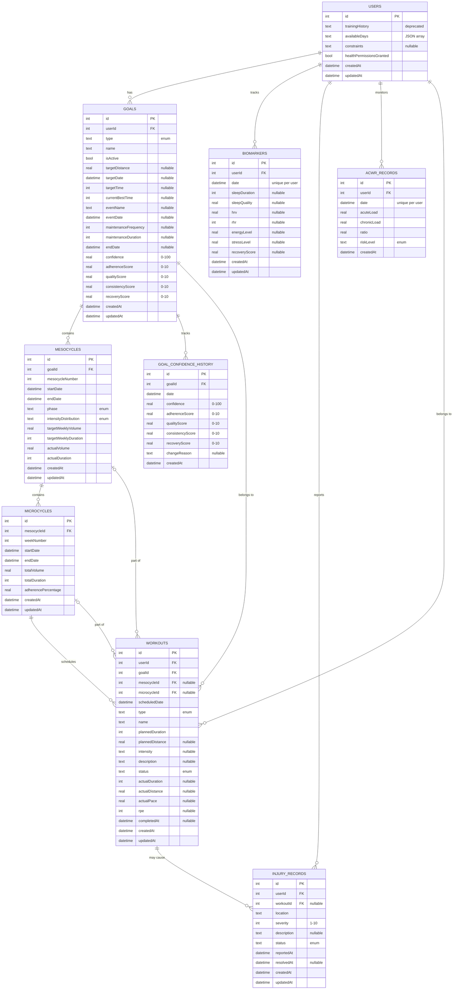

# Data Models Overview

**Purpose**: Define the database schema for Phase 1 of Ash Trainer, supporting onboarding, calendar view, and goal progress tracking.

**Technology**: Drift (SQLite) for offline-first local storage with optional cloud sync in later phases.

---

## Entity-Relationship Diagram

---

## Entity Summary

| Entity | Purpose | Key Relationships | Records Per User |
|--------|---------|-------------------|------------------|
| **users** | Profile and preferences | Root entity | 1 |
| **goals** | Training goals | 1 user : N goals | ~1-5 |
| **mesocycles** | 3-4 week training blocks | 1 goal : N mesocycles | ~3-5 per goal |
| **microcycles** | Weekly training plans | 1 mesocycle : N microcycles | 3-4 per mesocycle |
| **workouts** | Individual sessions | 1 microcycle : N workouts | ~3-7 per week |
| **biomarkers** | Daily health metrics | 1 user : N biomarkers | 1 per day |
| **injury_records** | Pain tracking | 1 user : N injuries | Variable |
| **acwr_records** | Load management | 1 user : N records | 1 per day |
| **goal_confidence_history** | Confidence trending | 1 goal : N history | 1 per goal per day |

---

## Design Decisions

### Single-User Architecture
- **Assumption**: One user per device installation
- **Rationale**: Simplifies Phase 1 implementation, offline-first design
- **Future**: Multi-user support can be added with authentication tables in Phase 2+

### Offline-First with Drift
- **Technology**: Drift (Flutter's SQLite wrapper)
- **Benefits**: 
  - Works offline by default
  - Fast local queries
  - Optional cloud sync layer in future
- **Trade-offs**: 
  - No built-in multi-device sync (Phase 1)
  - Requires migration strategy for schema changes

### Periodization Hierarchy
- **Structure**: Goal → Mesocycle → Microcycle → Workout
- **Rationale**: Matches sports science periodization model
- **Flexibility**: Workouts can exist without mesocycle/microcycle for ad-hoc sessions

### Daily Aggregated Records
- **Tables**: `biomarkers`, `acwr_records`
- **Pattern**: One record per user per day, **UPDATED** as new data arrives
- **Rationale**: Simplifies queries, reduces storage, matches health data sync patterns

---

## Screen-to-Data Mapping

See [Screen-to-Data Mapping](screen_to_data_mapping.md) for detailed mapping of all 23 Phase 1 screens to database entities.

---

## Related Documentation

- **[Entities](entities.md)** - Detailed table definitions
- **[Validation Rules](validation_rules.md)** - Input validation and business logic
- **[Data Lifecycle](data_lifecycle.md)** - Creation, updates, deletion, and cascade behavior

---

**Last Updated**: 2025-12-29
