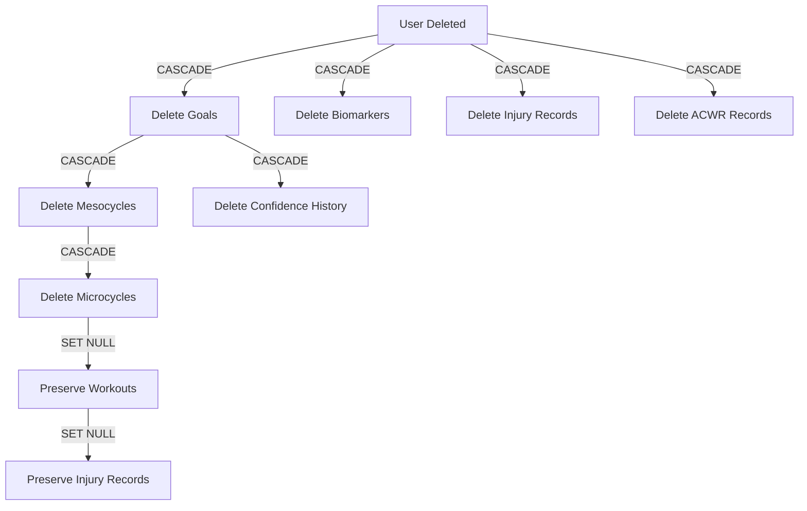

# Data Lifecycle

This document defines how data is created, updated, deleted, and how cascading behavior works across entities.

---

## 1. User Profile Domain

### Table: `users`

#### Creation
- **When**: First app launch, after welcome screen
- **Trigger**: Onboarding flow completion
- **Required fields**: None (all fields have defaults or are nullable)
- **Initial values**:
  - `healthPermissionsGranted = false`
  - `trainingHistory` = deprecated (not collected)
  - `availableDays` = all days (if skipped in onboarding)

#### Updates
- **Frequency**: Rare (only when user changes preferences)
- **Triggers**:
  - User grants/revokes health permissions
  - User updates available days in settings
  - User updates constraints in settings

#### Deletion
- **Strategy**: Hard delete (single-user app, delete on app uninstall)
- **Cascade behavior**: Delete all related data (goals, biomarkers, injuries, ACWR)
- **Implementation**: ON DELETE CASCADE for all foreign keys referencing `users.id`

---

## 2. Training Domain

### Table: `goals`

#### Creation
- **When**: Onboarding or when user creates new goal
- **Trigger**: Goal setup flow completion
- **Required fields**: `type`, `name`
- **Initial values**:
  - `confidence = 85.0`
  - `adherenceScore = 8.0`
  - `qualityScore = 8.0`
  - `consistencyScore = 8.0`
  - `recoveryScore = 8.0`
  - `isActive = true` (set previous active goal to `false`)

#### Updates
- **Frequency**: Daily (confidence scores) + occasional (goal details)
- **Triggers**:
  - Confidence recalculation (after workout completion)
  - User modifies goal details
  - Goal completion/switching

#### Deletion
- **Strategy**: Soft delete recommended (preserve training history)
- **Alternative**: Hard delete with cascade
- **Cascade behavior**: 
  - Delete all mesocycles → microcycles → workouts
  - Delete all confidence history
- **Implementation**: ON DELETE CASCADE for all foreign keys referencing `goals.id`

---

### Table: `mesocycles`

#### Creation
- **When**: Plan generation (during onboarding or goal creation)
- **Trigger**: AI generates training plan for goal
- **Required fields**: `goalId`, `mesocycleNumber`, `startDate`, `endDate`, `phase`, `intensityDistribution`, `targetWeeklyVolume`, `targetWeeklyDuration`
- **Initial values**:
  - `actualVolume = 0.0`
  - `actualDuration = 0`

#### Updates
- **Frequency**: Weekly (computed stats)
- **Triggers**:
  - Microcycle completion (update `actualVolume`, `actualDuration`)
  - Plan adjustment by AI

#### Deletion
- **Strategy**: Hard delete (part of goal lifecycle)
- **Cascade behavior**: Delete all microcycles → workouts
- **Implementation**: ON DELETE CASCADE for all foreign keys referencing `mesocycles.id`

---

### Table: `microcycles`

#### Creation
- **When**: Mesocycle creation (part of plan generation)
- **Trigger**: AI generates weekly plans within mesocycle
- **Required fields**: `mesocycleId`, `weekNumber`, `startDate`, `endDate`
- **Initial values**:
  - `totalVolume = 0.0`
  - `totalDuration = 0`
  - `adherencePercentage = 0.0`

#### Updates
- **Frequency**: Daily (as workouts complete)
- **Triggers**:
  - Workout completion (update computed stats)
  - End of week (finalize adherence percentage)

#### Deletion
- **Strategy**: Hard delete (part of mesocycle lifecycle)
- **Cascade behavior**: Delete all workouts (or set `microcycleId = NULL` for ad-hoc workouts)
- **Implementation**: ON DELETE SET NULL for `workouts.microcycleId` (preserve ad-hoc workouts)

---

### Table: `workouts`

#### Creation
- **When**: Plan generation or ad-hoc workout creation
- **Trigger**: 
  - AI generates weekly plan
  - User manually adds workout
- **Required fields**: `userId`, `goalId`, `scheduledDate`, `type`, `name`, `plannedDuration`
- **Initial values**:
  - `status = 'planned'`
  - All `actual*` fields = `NULL`

#### Updates
- **Frequency**: Multiple times per workout lifecycle
- **Triggers**:
  - Workout start: `status = 'in_progress'`
  - Workout completion: `status = 'completed'`, set `actualDuration`, `actualDistance`, `actualPace`, `rpe`, `completedAt`
  - User skips: `status = 'skipped'`
  - System marks missed: `status = 'missed'` (end of day cron job)
  - User reschedules: update `scheduledDate`

#### Deletion
- **Strategy**: Soft delete recommended (preserve training history)
- **Alternative**: Hard delete for future planned workouts only
- **Cascade behavior**: Set `injury_records.workoutId = NULL` (preserve injury records)
- **Implementation**: ON DELETE SET NULL for `injury_records.workoutId`

---

## 3. Health & Recovery Domain

### Table: `biomarkers`

#### Creation
- **When**: Daily (first health data sync of the day)
- **Trigger**: Health Connect/HealthKit data sync
- **Required fields**: `userId`, `date`
- **Initial values**: All metric fields = `NULL` (populated as data syncs)

#### Updates
- **Frequency**: Multiple times per day
- **Triggers**:
  - Health data sync (sleep, HRV, RHR)
  - User check-in (energy, stress)
  - Recovery score recalculation
- **Pattern**: **UPSERT** (insert if not exists, update if exists)

#### Deletion
- **Strategy**: Retain indefinitely (historical health data)
- **Alternative**: Delete records older than 1 year (data retention policy)
- **Cascade behavior**: None (no dependent entities)

---

### Table: `injury_records`

#### Creation
- **When**: User reports pain/injury
- **Trigger**: 
  - Post-workout pain check-in
  - Manual injury report
- **Required fields**: `userId`, `location`, `severity`
- **Initial values**:
  - `status = 'active'`
  - `reportedAt = now()`

#### Updates
- **Frequency**: Variable (as injury progresses)
- **Triggers**:
  - User updates severity
  - Status change: `active` → `recovering` → `resolved`
  - Resolution: set `resolvedAt`

#### Deletion
- **Strategy**: Retain indefinitely (medical history)
- **Alternative**: Soft delete (mark as archived)
- **Cascade behavior**: None (no dependent entities)

---

### Table: `acwr_records`

#### Creation
- **When**: Daily (after first workout of the day)
- **Trigger**: Workout completion triggers ACWR calculation
- **Required fields**: `userId`, `date`, `acuteLoad`, `chronicLoad`, `ratio`, `riskLevel`

#### Updates
- **Frequency**: Multiple times per day (as workouts complete)
- **Triggers**: Workout completion (recalculate ACWR)
- **Pattern**: **UPSERT** (insert if not exists, update if exists)

#### Deletion
- **Strategy**: Retain for 90 days (rolling window)
- **Cascade behavior**: None (no dependent entities)

---

## 4. Analytics Domain

### Table: `goal_confidence_history`

#### Creation
- **When**: Daily snapshot or significant confidence change
- **Trigger**: 
  - Midnight cron job (daily snapshot)
  - Confidence change \u003e 5% (immediate snapshot)
- **Required fields**: `goalId`, `date`, `confidence`, `adherenceScore`, `qualityScore`, `consistencyScore`, `recoveryScore`

#### Updates
- **Frequency**: None (immutable snapshots)
- **Pattern**: Insert-only (no updates)

#### Deletion
- **Strategy**: Delete with goal (cascade)
- **Cascade behavior**: None (no dependent entities)
- **Implementation**: ON DELETE CASCADE from `goals.id`

---

## Cascade Delete Summary



---

## Data Retention Policies

| Entity | Retention | Rationale |
|--------|-----------|-----------|
| **users** | Indefinite | Core profile data |
| **goals** | Indefinite (soft delete) | Training history |
| **mesocycles** | Indefinite | Periodization history |
| **microcycles** | Indefinite | Weekly training history |
| **workouts** | Indefinite (soft delete) | Training log |
| **biomarkers** | 1 year | Health trends |
| **injury_records** | Indefinite | Medical history |
| **acwr_records** | 90 days | Recent load management |
| **goal_confidence_history** | Indefinite | Goal tracking |

---

## Soft Delete Implementation

For entities that should preserve history (goals, workouts), implement soft delete:

```dart
// Add to table definition
BoolColumn get isDeleted => boolean().withDefault(const Constant(false))();
DateTimeColumn get deletedAt => dateTime().nullable()();

// Soft delete query
await (update(workouts)..where((t) => t.id.equals(workoutId)))
  .write(WorkoutsCompanion(
    isDeleted: Value(true),
    deletedAt: Value(DateTime.now()),
  ));

// Filter deleted records in queries
select(workouts)..where((t) => t.isDeleted.equals(false));
```

---

## Backup & Recovery

### Local Backup
- **Frequency**: Daily (background task)
- **Location**: Device storage (encrypted)
- **Retention**: Last 7 days

### Cloud Sync (Phase 2+)
- **Strategy**: Incremental sync of changed records
- **Conflict resolution**: Last-write-wins with timestamp comparison
- **Encryption**: End-to-end encryption for sensitive health data

---

**Last Updated**: 2025-12-29
