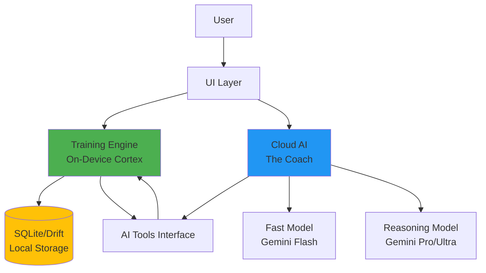
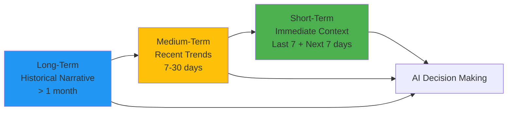
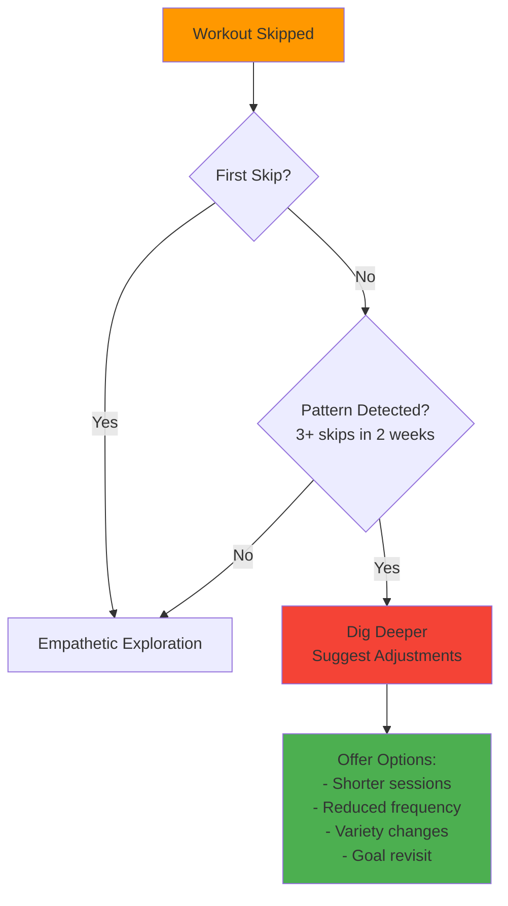
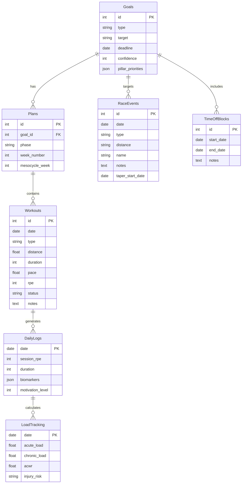
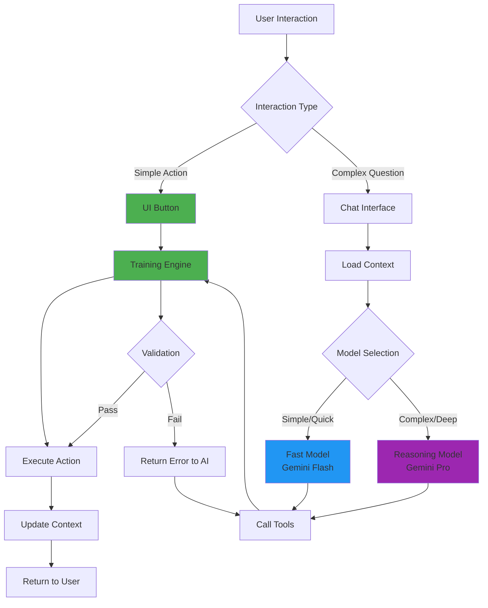

# Data Processing & AI Integration Plan

## Goal
Design a data processing strategy that prioritizes on-device calculation to minimize AI API costs, while ensuring long-term AI coherence and effective planning capabilities using an MCP-style tool approach.

---

## Architecture Overview

### Hybrid Architecture: Local-First, Cloud-Augmented



### Core Architectural Decisions

#### 1. **UI-First Strategy**
- **Principle**: Prioritize explicit action buttons over chat to minimize AI calls
- **Example**: "Skip Day" button → Training Engine pushes workouts +1 day (no AI needed)
- **Benefit**: Faster UX, zero cost, deterministic outcomes
- **When to use Chat**: Complex negotiations, "Why?" questions, empathetic exploration

#### 2. **On-Device Training Engine ("The Cortex")**
- **Technology**: Pure Dart logic
- **Storage**: SQLite (Drift) or Hive
- **Responsibilities**:
  - Schedule management (moving workouts, detecting conflicts)
  - Quantifiable math (goal confidence, pace adjustments, volume ramp-up)
  - Simple rule-based adjustments
  - Validation logic for all AI tool calls
- **Execution Strategy**: Run calculations aggressively (on every app open or data modification) to ensure AI context is always fresh

#### 3. **Cloud AI ("The Coach")**
- **Tiered Model Strategy**:
  
  | Model Type | Use Cases | Latency | Cost |
  |------------|-----------|---------|------|
  | **Fast/Cheap**<br/>(Gemini Flash) | Daily motivation, simple explanations, quick check-ins | Low | Low |
  | **Reasoning/Complex**<br/>(Gemini Pro) | Major plan reworks, deep progress analysis, injury assessment | Medium | High |

- **Trigger Logic**: Use Reasoning model when user explicitly requests "Plan Rework" OR engine detects major failure state

#### 4. **Plan Lifecycle Management**
- **Pause**: For indeterminate breaks (vacation, illness) - stops the clock
- **Reset/Remake**: For restarts after long breaks or life events - redirects to onboarding flow to re-establish baseline without "baggage"

#### 5. **MCP-Style Tools Architecture**
- **Structure**: Strict tool definitions that AI can call (function calling or actual MCP server)
- **Validation**: Engine validates all tool calls before execution
- **Error Handling**: Returns structured errors to AI with explanations

---

## Context Architecture: The "Coach's Memory"

### Three-Tier Time-Horizon Strategy

> [!IMPORTANT]
> This tiered approach prevents context window saturation while maintaining long-term coherence.



| Tier | Timeframe | Content | Usage |
|------|-----------|---------|-------|
| **Long-Term** | > 1 month ago | High-level journey summary, recurring habits, chronic issues | Big picture consistency, general projections (2+ weeks out) |
| **Medium-Term** | 7-30 days ago | Recent deviations, events, adherence patterns, emerging trends | Contextualizes current performance, explains current struggles |
| **Short-Term** | Last 7 + Next 7 days | High-fidelity logs, specific exercises, exact metrics, upcoming events | Heavily weighted for immediate planning (next 1-2 weeks) |

### Context Synthesis Example

The On-Device Engine generates this JSON structure before each AI request:

```json
{
  "context": {
    "long_term_summary": "User is planning a marathon on Oct 12. Started at beginner level. Increases volume ~15% weekly. Consistently skips strength training but does mobility. Has chronic left knee issue that responds well to unilateral work.",
    "medium_term_trends": "User returned from vacation on Dec 5. Ramped back up but is missing 30% of running workouts (higher than average). Knee reported as 2/10 pain last week. ACWR trending high (1.25) - approaching injury risk zone.",
    "short_term_detail": [
       { "day": -2, "activity": "Run", "status": "Completed", "rpe": 4, "notes": "Easy 5K" },
       { "day": -1, "activity": "Strength", "status": "Skipped", "reason": "Not motivated" }
    ],
    "pillar_priorities": {
      "running": "High",
      "strength": "Medium",
      "mobility": "Low"
    },
    "load_management": {
      "acwr": 1.15,
      "acwr_status": "Safe",
      "injury_risk": "Low"
    },
    "upcoming_events": [
      { "date": "2025-01-15", "type": "Tune-Up Race", "distance": "5K" }
    ],
    "current_phase": "Build",
    "goal_confidence": 87
  }
}
```

---

## Feature-Specific Tools

### 1. Context & State Management

**Purpose**: Provide AI with comprehensive snapshot of user's current state without dumping entire database.

#### Tools

| Tool | Purpose | Key Returns | Called In |
|------|---------|-------------|----------|
| `get_training_context` | Get current snapshot | Current goal, phase, adherence %, pillar priorities, ACWR, upcoming constraints, motivation patterns, weather conditions | All AI interactions (pre-request context loading) |

---

### 2. Pillar Coordination (Running, Strength, Mobility)

**Purpose**: Intelligently schedule workouts across all three pillars while respecting recovery principles.

#### Core Principles

- **Priority-Based Scheduling**: "Big Rocks First" - High-priority pillar workouts scheduled first
- **48-Hour Rule**: Allow 48 hours between hard efforts in the same pillar
- **Cross-Pillar Conflicts**: Avoid hard leg strength the day before a key run
- **Hard Days Hard, Easy Days Easy**: Never stack high-intensity sessions back-to-back across pillars

#### Recovery Week Adjustments

| Pillar | Adjustment |
|--------|------------|
| Running | -20% volume |
| Strength | Maintenance mode (lower volume, same intensity) |
| Mobility | Priority INCREASES (extra sessions to aid recovery) |

#### Tools

| Tool | Purpose | Key Params | Validation Logic | Called In |
|------|---------|------------|------------------|----------|
| `reschedule_workout` | Move workout to new date | `workout_id`, `new_date`, `reason` | Checks 48-hour rule, cross-pillar conflicts, vacation blocks, race taper periods | [Daily Training Loop](../ux/user_flows.md#2-daily-training-loop-the-core-experience) - Reschedule action |
| `adjust_intensity` | Scale workout difficulty | `workout_id`, `factor` (e.g., 0.8) | Ensures adjustments respect RPE targets and recovery principles | [Daily Training Loop](../ux/user_flows.md#2-daily-training-loop-the-core-experience) - Chat adjustment flow (fatigue) |
| `swap_workout` | Replace workout type | `workout_id`, `new_type` | Validates pillar coordination (no hard leg day before long run) | [Injury Management](../ux/user_flows.md#4-injury-management--recovery) - Swap run for strength |

---

### 3. Load Management & Injury Prevention

**Purpose**: Track training load and prevent overtraining injuries using ACWR (Acute:Chronic Workload Ratio).

#### ACWR Zones

| ACWR Range | Status | Recommendation |
|------------|--------|----------------|
| < 0.8 | Undertraining | Increase volume |
| 0.8 - 1.3 | Safe Zone | Maintain or progress gradually |
| > 1.3 | High Risk | Deload immediately |

**Formula**: Acute Load (last 7 days) ÷ Chronic Load (avg of last 3-4 weeks)

#### Tools

| Tool | Purpose | Key Params | Returns/Actions | Called In |
|------|---------|------------|-----------------|----------|
| `calculate_acwr` | Calculate injury risk | None | ACWR value, risk status, recommendation | Background calculation (aggressive), displayed in context |
| `log_session_rpe` | Record workout intensity | `workout_id`, `rpe` (1-10), `duration_minutes` | Updates weekly load totals and ACWR | [Daily Training Loop](../ux/user_flows.md#2-daily-training-loop-the-core-experience) - Post-workout logging |
| `log_biomarker` | Track subjective feedback | `type` (pain/mood/energy/sleep), `value`, `location`, `note` | Flags patterns (recurring pain, low energy streaks) | [Injury Management](../ux/user_flows.md#4-injury-management--recovery) - Pain reporting |

---

### 4. Race & Event Management

**Purpose**: Manage race events, implement taper protocols, and schedule appropriate recovery.

#### Race Types

| Type | Pre-Race Adjustment | Post-Race Recovery |
|------|---------------------|-------------------|
| Goal Race | 1-3 week taper (distance-dependent) | Full recovery week |
| Tune-Up Race | Reduce training 2-3 days before | 2-3 easy days |
| Fun Run | Slight intensity reduction day before | 1 easy day |
| Non-Running Event | No adjustment | No adjustment |

#### Taper Protocols by Distance

| Distance | Duration | Week 1 | Week 2 | Week 3 |
|----------|----------|--------|--------|--------|
| 5K | 7-10 days | -30% | -50% final 3-4 days | - |
| 10K | 10-14 days | -30% | -50% | - |
| Half Marathon | 2 weeks | -30% | -50% | - |
| Marathon | 3 weeks | -20% | -40% | -60% |

> [!NOTE]
> All tapers maintain intensity with short, sharp sessions while reducing volume.

#### Tools

| Tool | Purpose | Key Params | Logic | Called In |
|------|---------|------------|-------|----------|
| `add_race_event` | Add event to calendar | `date`, `type`, `distance`, `name`, `notes` | Initiates appropriate taper protocol and schedules post-race recovery | [Onboarding](../ux/user_flows.md#1-new-user-onboarding--first-workout) - Goal setting, Calendar add event |
| `trigger_taper` | Start taper protocol | `race_id`, `race_distance` | Implements distance-specific volume reductions while maintaining intensity | [Race Day Preparation](../ux/user_flows.md#6-race-day-preparation--taper) - Automatic at 3 weeks before race |

---

### 5. Time-Off Management

**Purpose**: Handle planned breaks and safe return to training after time off.

#### Time-Off Behavior

**During Time Off:**
- **No Pre-Scheduled Workouts**: Calendar is completely empty during blocked period
- **Notifications Suppressed**: No training reminders
- **Ad-Hoc Workouts Available**: User can open app and request a workout for that specific day
- **No Pressure**: Ad-hoc workouts don't affect goal confidence or adherence metrics

**Use Cases:**
- Vacation (beach trip, travel)
- Work travel (business conference)
- Life events (finals week, family emergency)
- Recovery periods (post-race rest week)

#### Return-From-Break Protocols

| Break Type | Severity | Resume Volume | Progression Rate |
|------------|----------|---------------|------------------|
| Illness | Mild | 50% | 10-20%/week |
| Illness | Moderate | 30% (after 3-5 days symptom-free) | 15%/week |
| Injury | Minor (1-2 weeks) | 60% for affected activities | Gradual |
| Injury | Major (4+ weeks) | Treat as beginner for that movement | Very gradual |
| Time Off | 1-3 days | 100% (minimal impact) | Normal |
| Time Off | 4-7 days | 80% | Normal |
| Time Off | 1-2 weeks | 70% | Cautious |
| Time Off | 2+ weeks | 50% (treat as training break) | 10-20%/week |

#### Tools

| Tool | Purpose | Key Params | Logic | Called In |
|------|---------|------------|-------|----------|
| `schedule_time_off` | Block out dates | `start_date`, `end_date`, `notes` | Clears schedule, suppresses notifications, updates goal confidence | [Vacation/Time-Off Scheduling](../ux/user_flows.md#3-vacationtime-off-scheduling) - Add time off flow |
| `request_adhoc_workout` | Request workout during time off | `date`, `workout_type` (optional), `duration` (optional) | Generates single workout for that day, doesn't affect adherence metrics | Time-off period - user opens app and requests workout |
| `return_from_break` | Safe return protocol | `break_type`, `duration_days`, `severity` | Adjusts training plan based on break type and duration | [Vacation/Time-Off Scheduling](../ux/user_flows.md#3-vacationtime-off-scheduling) - First workout after break, [Injury Management](../ux/user_flows.md#4-injury-management--recovery) - Return-to-training protocol |

---


### 6. Motivation & Mental Health

**Purpose**: Track motivation patterns, detect burnout, and intervene appropriately.

#### Intervention Strategy



#### Tools

| Tool | Purpose | Key Params | Logic | Called In |
|------|---------|------------|-------|----------|
| `log_motivation` | Record motivation state | `level` (1-10), `reason`, `note` | Detects patterns and triggers interventions | [Daily Training Loop](../ux/user_flows.md#2-daily-training-loop-the-core-experience) - Chat adjustment flow ("not motivated") |
| `detect_skip_pattern` | Analyze adherence patterns | None | Returns skip frequency, pattern type, suggested intervention | Background analysis, triggers intervention conversation |

---

### 7. Plateau Detection & Intervention

**Purpose**: Identify performance stagnation and implement evidence-based interventions.

#### Plateau Protocols

| Protocol Type | Duration | Adjustments | Use Case |
|---------------|----------|-------------|----------|
| Deload | 1 week | -40% volume, maintain intensity | Accumulated fatigue |
| Variation | 2-3 weeks | Swap exercises, change rep ranges | Adaptation plateau |
| Volume Block | 3-4 weeks | +20-30% volume, lower intensity (+1 RIR/RPE) | Need more stimulus |

#### Tools

| Tool | Purpose | Key Params | Returns/Actions | Called In |
|------|---------|------------|-----------------|----------|
| `detect_plateau` | Analyze recent performance | None | Plateau status, affected pillar, duration, suggested intervention | Background analysis, triggers proactive Ash conversation |
| `trigger_plateau_protocol` | Implement intervention | `pillar`, `protocol_type` | Implements 2-3 week intervention block | Chat conversation after plateau detected |

---

### 8. Environmental Adaptations

**Purpose**: Adjust training based on weather and environmental conditions.

#### Weather-Based Adjustments

| Condition | Threshold | Adjustment |
|-----------|-----------|------------|
| Extreme Heat | > 90°F (32°C) | Reduce intensity by 1 RPE, suggest early/late timing |
| Extreme Cold | Below freezing with wind chill | Shorten duration, indoor warm-up required |
| Poor Air Quality | AQI > 150 | Move all outdoor activity indoors |
| No Safe Outdoor Space | Travel/hotel | Suggest hotel gym, bodyweight circuits |

#### Tools

| Tool | Purpose | Key Params | Returns/Actions | Called In |
|------|---------|------------|-----------------|----------|
| `check_weather` | Get weather forecast | `date`, `location` | Temperature, heat index, AQI, precipitation, recommendation | [Daily Training Loop](../ux/user_flows.md#2-daily-training-loop-the-core-experience) - Today's workout screen (weather display), Smart notifications |
| `adjust_for_weather` | Modify workout for conditions | `workout_id`, `weather_condition` | Swaps outdoor for treadmill, reduces intensity, or changes type | Proactive weather alert notification, Chat adjustment flow |

---

### 9. Advanced Data Processing

**Purpose**: Extract structured data from external sources and calculate complex metrics.

#### Tools

| Tool | Purpose | Key Params | Returns/Actions | Called In |
|------|---------|------------|-----------------|----------|
| `process_screenshot` | Extract data from images | `image_data`, `expected_type` | Uses OCR + AI vision to extract structured metrics | Chat conversation - user uploads training data/race results |
| `calculate_goal_confidence` | Multi-factor goal analysis | None | Confidence % (0-100%) with breakdown | Background calculation (aggressive), [Goal Confidence Monitoring](../ux/user_flows.md#5-goal-confidence-monitoring--adjustment) - Dashboard display |

#### Goal Confidence Factors

- Completed workouts (adherence %)
- Workout quality (hitting pace/distance targets)
- Consistency (training frequency)
- Recovery (adequate rest, ACWR status)
- Time remaining (proximity to deadline)
- Recent performance trends

---

## Database Schema

### Core Tables



---

## AI Integration Strategy

### System Prompt Structure

1. **Ash Personality**: Empathetic, knowledgeable, adaptive coach persona
2. **Context Window Management**: 3-tier memory system instructions
3. **Tool Calling Instructions**: When and how to use each tool
4. **Edge Case Handling**: Injury, motivation, weather, vacation protocols

### Conversation Flow Logic



### Token Budget Management

- **Cache context synthesis results** to avoid regenerating on every request
- **Optimize database queries** to minimize context generation time
- **Smart caching**: Reuse context if no data changes since last AI call
- **Minimize AI calls**: Use UI-first strategy to handle 80% of interactions deterministically
