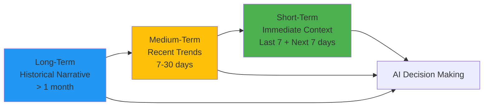

# Context Engine

> **Used By**: [Goals](../../ux/product_spec/training/goals.md), [Coaching](../../ux/product_spec/training/coaching.md), [Biomarkers](../../ux/product_spec/athlete_markers/biomarkers.md)  
> **Data Models**: [All Models](../data_models/_index.md)

## The "Coach's Memory"

The Training Engine synthesizes data from all tables into a three-tier context structure for AI interactions. This tiered approach prevents context window saturation while maintaining long-term coherence.



| Tier | Timeframe | Content | Usage |
|------|-----------|---------|-------|
| **Long-Term** | > 1 month ago | High-level journey summary, recurring habits, chronic issues | Big picture consistency, general projections (2+ weeks out) |
| **Medium-Term** | 7-30 days ago | Recent deviations, events, adherence patterns, emerging trends | Contextualizes current performance, explains current struggles |
| **Short-Term** | Last 7 + Next 7 days | High-fidelity logs, specific exercises, exact metrics, upcoming events | Heavily weighted for immediate planning (next 1-2 weeks) |

---

## 1. Long-Term Context (> 1 month ago)

**Purpose:** High-level journey summary for big picture consistency

**Data Sources:**
- `Goals`: Goal type, target, chronic patterns
- `InjuryRecords`: Recurring injury history
- `RaceEvents`: Historical race results, race frequency patterns
- `UserProfiles`: Pillar priorities, baseline fitness
- `WorkoutLogs`: Overall adherence patterns (aggregated)

**Example Output:**
```json
{
  "goal": {
    "type": "event",
    "target": "Marathon - Sub 4:00:00",
    "deadline": "2024-10-12",
    "weeks_elapsed": 8,
    "weeks_remaining": 8
  },
  "user_baseline": {
    "activity_level": "casual",
    "pillar_priorities": { "running": "high", "strength": "medium", "mobility": "low" },
    "estimated_vo2_max": 42.5
  },
  "adherence_patterns": {
    "overall_completion_rate": 0.72,
    "running_completion_rate": 0.85,
    "strength_completion_rate": 0.45,
    "mobility_completion_rate": 0.80,
    "avg_weekly_volume_km": 35.2,
    "volume_progression_rate": 0.15
  },
  "injury_history": [
    {
      "type": "knee_pain",
      "location": "left_knee",
      "first_reported": "2024-06-15",
      "resolved_at": "2024-07-20",
      "notes": "Responds well to unilateral work and mobility focus"
    }
  ],
  "race_history": [
    { "date": "2024-08-15", "distance": "5K", "time_seconds": 1335, "is_pr": true },
    { "date": "2024-09-10", "distance": "10K", "time_seconds": 2790 },
    { "date": "2024-10-01", "distance": "Half", "time_seconds": 6120 }
  ]
}
```

---

## 2. Medium-Term Context (7-30 days ago)

**Purpose:** Recent trends and deviations to contextualize current performance

**Data Sources:**
- `WorkoutLogs`: Recent adherence patterns, session loads for ACWR calculation
- `Biomarkers`: Energy/sleep/stress/motivation patterns
- `RaceEvents`: Recent races (last 30 days) for recovery assessment
- `TimeOffDays`: Recent time-off days
- `TrainingPlan` / `Mesocycles`: Recent phase transitions, mesocycle progression
- `UserProfiles`: Current ACWR (calculated from WorkoutLogs)

**Example Output:**
```json
{
  "adherence_last_30_days": {
    "completion_rate": 0.70,
    "running_completion_rate": 0.65,
    "missed_workouts": 9,
    "deviation_from_average": -0.15
  },
  "load_management": {
    "acute_load": 2800,
    "chronic_load": 2240,
    "acwr": 1.25,
    "injury_risk": "moderate",
    "trend": "increasing"
  },
  "active_injuries": [
    {
      "id": 42,
      "type": "soreness",
      "location": "left_knee",
      "severity": 3,
      "status": "active",
      "first_reported": "2024-12-23",
      "last_reported": "2024-12-28",
      "days_since_report": 5
    }
  ],
  "biomarker_trends": {
    "energy_avg": 6.2,
    "sleep_quality_avg": 5.8,
    "stress_avg": 6.5,
    "motivation_avg": 4.1,
    "motivation_trend": "declining"
  },
  "recent_events": [
    {
      "type": "time_off",
      "start_date": "2024-12-01",
      "end_date": "2024-12-05",
      "notes": "Vacation"
    },
    {
      "type": "race",
      "date": "2024-11-28",
      "distance": "10K",
      "time_seconds": 2805,
      "rpe": 8,
      "notes": "Tune-up race"
    }
  ],
  "phase_transition": {
    "from_phase": "base",
    "to_phase": "build",
    "transition_date": "2024-12-14",
    "days_in_new_phase": 14
  }
}
```

---

## 3. Short-Term Context (Last 7 + Next 7 days)

**Purpose:** High-fidelity immediate context for next 1-2 weeks of planning

**Data Sources:**
- `TrainingPlan` / `Mesocycles` / `Microcycles`: Current phase, week, mesocycle status
- `PlannedWorkouts`: Upcoming schedule
- `WorkoutLogs`: Recent completed workouts (detailed)
- `RaceEvents`: Upcoming races
- `TimeOffDays`: Upcoming time-off days
- `Biomarkers`: Latest energy/sleep/stress/motivation reports

**Example Output:**
```json
{
  "current_plan": {
    "phase": "build",
    "week": 8,
    "total_weeks": 16,
    "mesocycle_week": 4,
    "is_recovery_week": true,
    "periodization": "pyramidal"
  },
  "upcoming_workouts_detailed": [
    // Next 7 days - FULL PlannedWorkout objects for direct modification
    {
      "day": 0,
      "id": 123,
      "date": "2024-12-29",
      "pillar": "running",
      "type": "tempo",
      "distance_km": 8.0,
      "target_rpe": 7,
      "is_key_session": true,
      "workout_structure": {
        "warmup": { "duration_min": 15, "rpe": 3 },
        "main": { "duration_min": 30, "rpe": 7 },
        "cooldown": { "duration_min": 10, "rpe": 3 }
      }
    },
    {
      "day": 1,
      "id": 124,
      "date": "2024-12-30",
      "pillar": "strength",
      "type": "upper_body",
      "target_rpe": 6,
      "workout_structure": {
        "exercises": ["bench_press", "rows", "shoulder_press"]
      }
    }
  ],
  "upcoming_workouts_summary": [
    // Days 8-14 - Summary only (use get_workout_details tool if modification needed)
    { "day": 8, "id": 130, "type": "long_run", "distance_km": 16.0, "is_key_session": true },
    { "day": 10, "id": 132, "type": "intervals", "is_key_session": true }
  ],
  "completed_workouts_recent": [
    { "day": -2, "activity": "Easy Run", "status": "Completed", "rpe": 4, "distance_km": 5.0, "notes": "Felt good" },
    { "day": -1, "activity": "Strength", "status": "Skipped", "reason": "Low motivation (3/10)" }
  ],
  "active_injuries": [
    { "location": "left_knee", "severity": 3, "status": "recovering", "days_since_report": 5 }
  ],
  "recent_biomarkers": {
    "energy": 7,
    "sleep_quality": 6,
    "motivation": 4
  }
}
```

> [!NOTE]
> **Full Workout Details in Context**: The next 7 days include complete `PlannedWorkout` objects with all fields, enabling the AI to directly modify workouts without additional tool calls. For workouts beyond 7 days, the AI can use the `get_workout_details` tool if modification is needed.

## 🗄️ Data Sources

| Source | Description |
|--------|-------------|
| **All Models** | [Data Models Index](../data_models/_index.md) |
