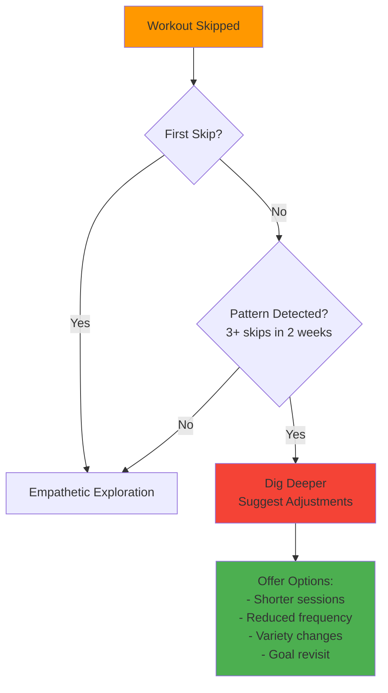

# Secondary Markers & Advanced Processing

**Purpose**: Track motivation patterns, detect burnouts/plateaus, and handle environmental adaptations.

## 1. Motivation & Mental Health

**Intervention Strategy**:


## 2. Plateau Detection

**Purpose**: Identify performance stagnation and implement evidence-based interventions.

| Protocol Type | Duration | Adjustments | Use Case |
|---------------|----------|-------------|----------|
| Deload | 1 week | -40% volume, maintain intensity | Accumulated fatigue |
| Variation | 2-3 weeks | Swap exercises, change rep ranges | Adaptation plateau |
| Volume Block | 3-4 weeks | +20-30% volume, lower intensity (+1 RIR/RPE) | Need more stimulus |

## 3. Environmental Adaptations

**Weather-Based Adjustments**:

| Condition | Threshold | Adjustment |
|-----------|-----------|------------|
| Extreme Heat | > 90°F (32°C) | Reduce intensity by 1 RPE, suggest early/late timing |
| Extreme Cold | Below freezing with wind chill | Shorten duration, indoor warm-up required |
| Poor Air Quality | AQI > 150 | Move all outdoor activity indoors |
| No Safe Outdoor Space | Travel/hotel | Suggest hotel gym, bodyweight circuits |

## 4. Goal Confidence Calculation

**Goal Confidence Factors**:
- Completed workouts (adherence %)
- Workout quality (hitting pace/distance targets)
- Consistency (training frequency)
- Recovery (adequate rest, ACWR status)
- Time remaining (proximity to deadline)
- Recent performance trends

```dart
double calculateGoalConfidence(...) {
  // Logic: Weighted average of above factors, penalized by injury risk
  // See data_models/system.md for full formula
}
```

## Related Tools

| Tool | Purpose | Called In |
|------|---------|-----------|
| `log_biomarker` | Track health feedback | Daily check-in |
| `detect_skip_pattern` | Analyze adherence | Background analysis |
| `detect_plateau` | Analyze performance | Background analysis |
| `check_weather` | Get forecast | Daily Training Loop |
| `calculate_goal_confidence` | Multi-factor analysis | Background calculation |
