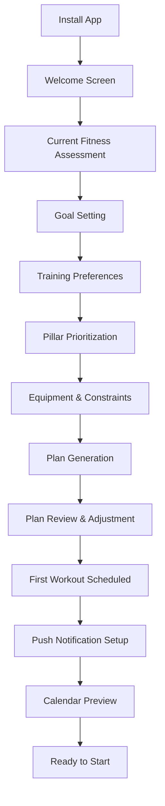
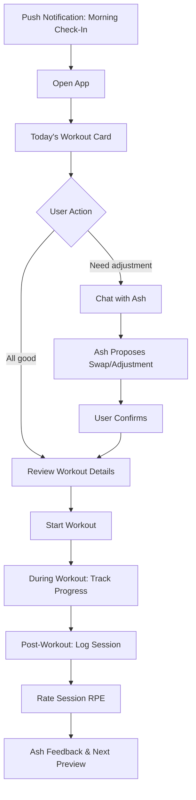
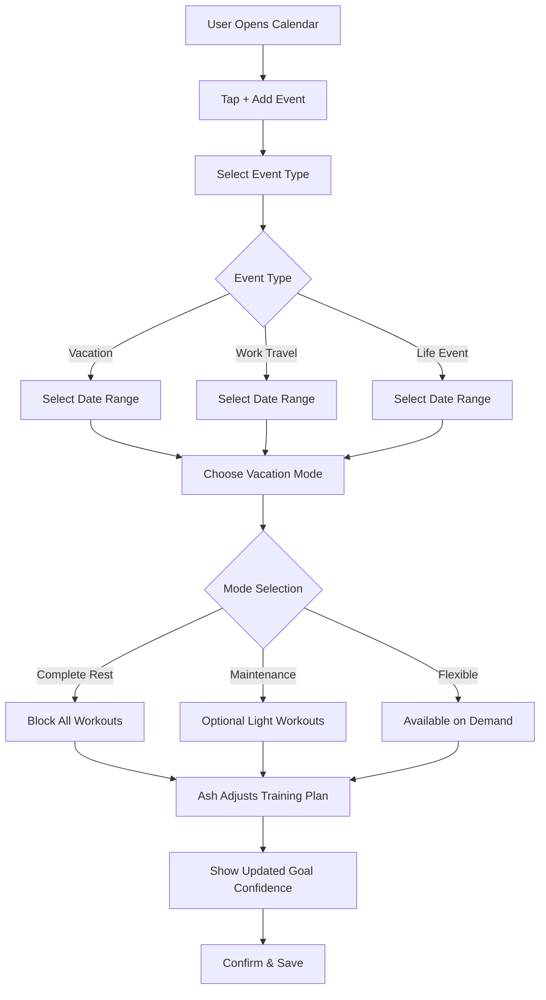
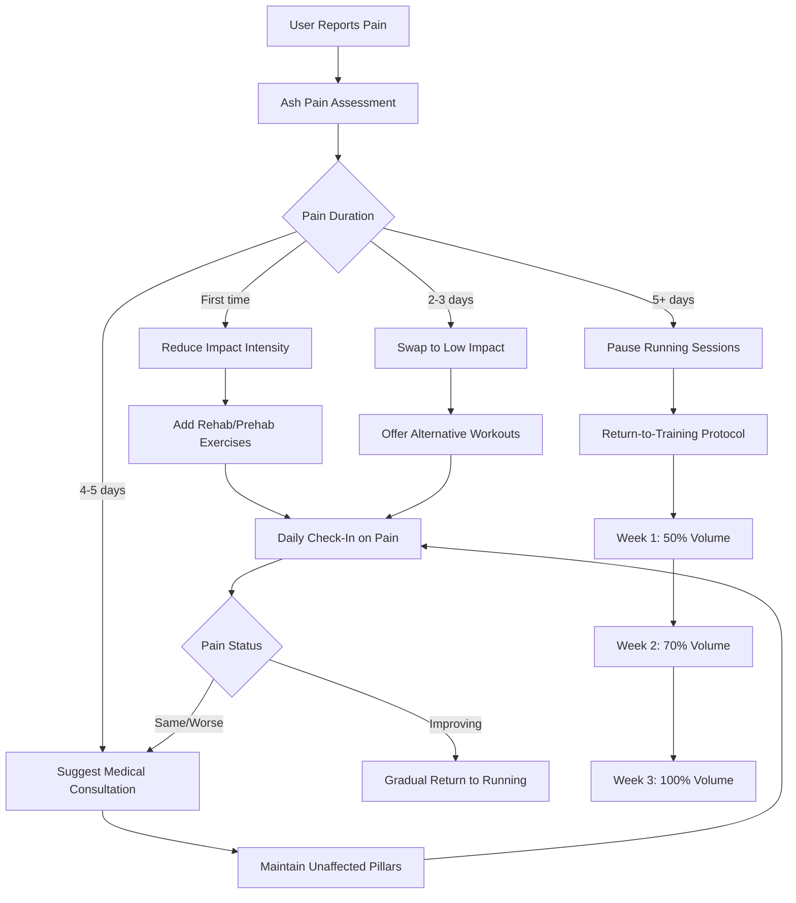

# Ash - User Flows & Interaction Design

This document maps the features from the [Product Spec](product_spec.md) and philosophies from the [Training Philosophy](../ai/training_philosophy.md) to concrete user flows and interaction patterns.

---

## 🎯 Core User Journeys

### 1. New User Onboarding → First Workout

**Goal:** Get a new user from app install to their first successful training session with confidence.

#### Flow Steps



#### Detailed Screen Flow

##### Screen 1: Welcome to Ash
- **Visual:** Friendly Ash avatar animation
- **Content:** 
  - "Hi, I'm Ash, your AI training coach"
  - Brief value props (3-4 bullet points)
  - "Let's build a plan that works for you"
- **CTA:** "Get Started" button

##### Screen 2: Current Fitness Level
- **Question:** "How would you describe your current activity level?"
- **Options:**
  - 🌱 Just getting started
  - 🏃 Casually active (1-2x/week)
  - 💪 Regularly training (3-4x/week)
  - 🔥 Very active (5+x/week)
- **Why:** Maps to **Starting Volume Estimates** ([training_philosophy.md:436-443](file:///Users/rooshi/Documents/programming/flutter/ash-trainer/docs/ai/training_philosophy.md#L436-L443))

##### Screen 3: Goal Setting
- **Question:** "What are you training for?"
- **Input Types:**
  - Distance milestone (dropdown: 5K, 10K, Half, Marathon)
  - Performance target (time + distance)
  - General fitness maintenance
- **Follow-up:** "When do you want to achieve this?"
  - Date picker OR "As soon as possible"

##### Screen 4: Training Preferences
- **Questions:**
  1. "How many days per week can you train?" (3-7 slider)
  2. "Do you have any injuries or limitations?" (Optional text input)

##### Screen 5: Pillar Prioritization
- **Visual:** Three columns (Running, Strength, Mobility)
- **Interaction:** Select one pillar as High priority, others default to Medium/Low
- **Constraint:** Only one pillar can be set to High priority
- **Real-time Feedback:** Shows estimated weekly breakdown
  - Example: "4 runs, 2 strength sessions, 3 mobility sessions"
- **Philosophy Link:** Maps to **Holistic Three-Pillar Integration** ([training_philosophy.md:30-43](file:///Users/rooshi/Documents/programming/flutter/ash-trainer/docs/ai/training_philosophy.md#L30-L43))

##### Screen 6: Plan Generation
- **Visual:** Loading animation with coaching tips
- **Content:** 
  - "Creating your personalized plan..."
  - Shows brief educational tips while loading
- **Backend:** Ash generates **Week 1 of 4-week mesocycle** ([training_philosophy.md:422-445](file:///Users/rooshi/Documents/programming/flutter/ash-trainer/docs/ai/training_philosophy.md#L422-L445))

##### Screen 7: Plan Review
- **Visual:** Week view showing the first week
- **Content:**
  - Weekly breakdown (color-coded badges)
  - Key metrics: weekly mileage, session count
- **CTA:** 
  - "Looks good, let's start!"
  - "Adjust plan" (goes to chat with Ash)

##### Screen 8: First Workout Ready
- **Content:**
  - "Your first workout: Tomorrow at 7:00 AM"
  - Shows workout card (type, duration, RPE)
  - "I'll check in with you in the morning 🌅"
- **CTA:** "Set notification preferences"

---

### 2. Daily Training Loop (The Core Experience)

**Goal:** Make daily workout decisions frictionless and adaptive.

#### Morning Check-In Flow



#### Screen Details

##### Morning Notification
- **Time:** User-configured (default 7:00 AM)
- **Content:** "Good morning! Here's what I have planned for you today [emoji]"
  - Emoji changes based on workout type (can be multiple): 🏃 (run), 💪 (strength), 🧘 (mobility), 🛌 (rest)
- **Action:** Tap to open app

##### Today's Workout Screen
- **Hero Section:**
  - Workout type badge (color-coded)
  - Workout name: "Easy Aerobic Run"
  - Duration: 40 minutes
  - Intensity: RPE 3-4 (with explanation)
- **Details Expandable:**
  - Purpose: "Building aerobic base without fatigue"
  - Warm-up routine (linked)
  - Cool-down routine (linked)
  - Weather conditions (if available)
- **Quick Actions:**
  - ✅ "I'm ready" → Start workout
  - 💬 "Need to adjust" → Chat with Ash
  - 📅 "Reschedule" → Opens swap dialog

##### Chat Adjustment Flow (Example: User Reports Fatigue)
1. **User:** "I'm feeling really tired today"
2. **Ash:** "I hear you. Can you tell me more? Are you: 
   - Physically exhausted (sore muscles, low energy)
   - Mentally drained (stressed, poor sleep)
   - Just not feeling motivated today"
3. **User:** "Poor sleep, mentally drained"
4. **Ash:** "Got it. A few options:
   - ✅ **Light walk (20 min)** - Fresh air, no pressure (Confidence: 98%)
   - 🧘 **Mobility session (15 min)** - Gentle movement (Confidence: 97%)
   - 🛌 **Take a rest day** - Full recovery (Confidence: 95%)
   
   What feels right?"
5. **User:** Selects option
6. **Ash:** "Perfect. I've updated today's plan. Tomorrow we'll ease back in with [next workout]."

**Philosophy Link:** Maps to **Mental Health & Motivation Days** ([training_philosophy.md:261-304](file:///Users/rooshi/Documents/programming/flutter/ash-trainer/docs/ai/training_philosophy.md#L261-L304))

##### Post-Workout Logging
- **Immediate Prompt:** "How did that feel?"
- **RPE Slider:** 1-10 scale with descriptors
  - 1-2: Very easy
  - 3-4: Easy (conversational)
  - 5-6: Moderate
  - 7-8: Hard
  - 9-10: Maximum effort
- **Optional Field:**
  - Any pain/discomfort/other things I should know? (flags for Ash)
- **Ash Response:**
  - "Nice work! That RPE tells me you're recovering well."
  - Updates **Acute Load** for ACWR tracking ([training_philosophy.md:51-69](file:///Users/rooshi/Documents/programming/flutter/ash-trainer/docs/ai/training_philosophy.md#L51-L69))

---

### 3. Vacation/Time-Off Scheduling

**Goal:** Allow users to proactively block out time without guilt or plan disruption.

#### Flow



#### Screen Details

##### Add Time Off Screen
- **Title:** "Schedule Time Off"
- **Date Picker:** Start date → End date
- **Behavior:**
  - No scheduled workouts during this period
  - Notifications turned off
  - If user opens app, they can request ad-hoc workouts for that day
  - Calendar displays blocked period with 📴 icon

##### Ash's Response Screen
- **Acknowledgment:** "Got it! I've blocked out June 15-22 for time off 📴"
- **Training Adjustments:**
  - "I've rescheduled your long run to June 14"
  - "You'll have an easy comeback workout on June 23"
- **Goal Impact:**
  - **Before:** 92% confidence
  - **After:** 89% confidence
  - "This won't meaningfully affect your marathon goal."
- **What Happens:**
  - ✅ No push notifications during time off
  - ✅ Open app anytime to request ad-hoc workouts for that day
  - ✅ Ad-hoc workouts don't count toward goal metrics
- **CTA:** "Confirm Time Off" / "Adjust Dates"

**Philosophy Link:** Maps to **Schedule Vacation / Time Off** ([product_spec.md:452-522](file:///Users/rooshi/Documents/programming/flutter/ash-trainer/docs/ux/product_spec.md#L452-L522))

---

### 4. Injury Management & Recovery

**Goal:** Provide a safe path from injury detection to recovery without forcing users to stop training entirely.

#### Flow



#### Conversation Example: Day 1 of Knee Pain

**User:** "My knee is hurting a bit"

**Ash:** "Thanks for letting me know. A few quick questions:
1. On a scale of 1-10, how much does it hurt? (1=barely noticeable, 10=can't walk)
2. What makes it worse? (Running, jumping, lifting, stairs)
3. What makes it better? (Rest, ice, stretching)"

**User:** "About a 4. Worse when running, fine when lifting."

**Ash:** "Got it. Here's what we'll do:
- ❌ **Cancel today's run** (protect the knee)
- ✅ **Swap: Upper body strength + core** (30 min)
- 🧘 **Add: Knee-friendly mobility routine** (glute bridges, hip stretches)

This keeps you training without aggravating the knee. I'll check in tomorrow—if it's still bothering you, we'll adjust further. Sound good?"

**User:** "Yes"

**Ash:** "Perfect. Your updated workout is ready. Hope the knee feels better soon!"

#### Escalation Protocol (Day 5+ of Pain)

**Ash:** "I've noticed your knee has been bothering you for 5 days now. At this point, I recommend seeing a physiotherapist or sports doctor to get a proper diagnosis.

In the meantime:
- ✅ I've paused all running sessions
- ✅ I can still plan strength for upper body + core if you'd like
- ✅ When you're cleared to run, I'll create a gradual return-to-training plan

Let me know what the doc says, and we'll go from there. 💪"

**Philosophy Link:** Maps to **Injury & Pain Management** ([training_philosophy.md:213-242](file:///Users/rooshi/Documents/programming/flutter/ash-trainer/docs/ai/training_philosophy.md#L213-L242))

---

### 5. Goal Confidence Monitoring & Adjustment

**Goal:** Keep users informed and motivated, with transparent feedback on their progress.

#### Visual Components

```
┌─────────────────────────────────────┐
│   🎯 Marathon Goal: April 15        │
│   ━━━━━━━━━━━━━━━━━━━━━━━━◯━━━━━   │
│   87% Confidence                    │
│   ↓ -5% from last week              │
│                                     │
│   Tap to see breakdown ↓            │
└─────────────────────────────────────┘
```

#### Expanded Breakdown (Tap to View)

```
┌─────────────────────────────────────┐
│ 🎯 Confidence Breakdown             │
├─────────────────────────────────────┤
│ ✅ Workout Adherence        +15     │
│    (4/5 workouts completed)         │
│                                     │
│ 📊 Workout Quality          +10     │
│    (Hitting pace targets)           │
│                                     │
│ 📅 Consistency              +8      │
│    (3-week streak)                  │
│                                     │
│ 🛌 Recovery                 -5      │
│    (Missed 1 rest day)              │
│                                     │
│ ⏱️ Time Remaining           +5      │
│    (On track with 12 weeks left)    │
│                                     │
│ 📈 Recent Performance       +4      │
│    (Improving pace)                 │
├─────────────────────────────────────┤
│ Total: 87%                          │
│                                     │
│ 💡 To improve:                      │
│ "Complete your next 3 easy runs     │
│  to rebuild consistency"            │
└─────────────────────────────────────┘
```

#### Alert Flow: Confidence Drops Below 80%

**Push Notification:** "Your marathon confidence has dropped to 78%. Let's chat."

**In-App Message:**
"Hey! I noticed your confidence dropped this week. Let's figure out what's going on.

**Recent Challenges:**
- Missed 2 runs last week
- Long run cut short

**Options:**
1. 📅 **Push deadline back 2 weeks** → Confidence: 92%
2. 🎯 **Adjust goal** (Half Marathon instead) → Confidence: 95%
3. 💪 **Stay the course** (need perfect adherence) → Confidence: 78%
4. 💬 **Tell me what's going on** → Let's talk it through

What feels right?"

**Philosophy Link:** Maps to **Goal Confidence Tracker** ([product_spec.md:83-106](file:///Users/rooshi/Documents/programming/flutter/ash-trainer/docs/ux/product_spec.md#L83-L106))

---

### 6. Race Day Preparation & Taper

**Goal:** Guide users through the final weeks before a goal race with structured taper and mental prep.

#### Timeline Flow (Example: Marathon)

```
Week -3: Peak Volume Week
  ↓
Week -2: Taper Begins (-30% volume)
  ↓
Week -1: Deep Taper (-60% volume)
  ↓
Race Week: Minimal Volume
  ↓
Race Day!
  ↓
Recovery Week: Easy return
```

#### Screen: Taper Week Begins

**Visual:** Calendar highlights "TAPER WEEK" with special badge

**Ash's Message:**
"🏆 **Taper Time!**

Your marathon is in 3 weeks. Starting today, we're reducing volume to let your body fully recover and sharpen up.

**What Changes:**
- Running volume: -30% (but keeping some speed work)
- Strength: 1 light maintenance session
- Mobility: Priority HIGH (extra recovery sessions)

**What Stays the Same:**
- Intensity on key sessions (short, sharp efforts)
- Your sleep and nutrition focus

**Your Job:**
- Trust the process (it'll feel easy—that's the point!)
- Protect your sleep
- Avoid trying anything new (food, shoes, routes)

You've done the work. Now we let you absorb it. 💪"

#### Race Week Checklist

**Screen:** Interactive checklist users can tick off

```
Race Week Prep ✓
┌─────────────────────────────────────┐
│ [✓] Laid out race outfit            │
│ [✓] Prepped race nutrition          │
│ [✓] Confirmed transportation        │
│ [✓] Set multiple alarms             │
│ [ ] Completed shake-out run         │
│ [ ] Hydrated + early dinner         │
│ [ ] Early bedtime (8+ hours)        │
│ [ ] Visualized race strategy        │
└─────────────────────────────────────┘

💬 Feeling nervous? That's normal. 
Tap here to chat with Ash.
```

#### Pre-Race Pep Talk (Day Before)

**Ash's Message:**
"Tomorrow is the day! Here's what I want you to remember:

✅ **You've done the training.** Your body is ready.
✅ **Trust your plan.** Start easy, finish strong.
✅ **Enjoy the experience.** This is your victory lap.

**Race Strategy Reminder:**
- First 5K: Easy effort (save energy)
- Middle: Settle into goal pace
- Last 10K: Give what you've got left

I'll be here after the race to celebrate. Go get it! 🏆"

**Philosophy Link:** Maps to **Event-Based Periodization** ([training_philosophy.md:139-191](file:///Users/rooshi/Documents/programming/flutter/ash-trainer/docs/ai/training_philosophy.md#L139-L191))

---

## 🗺️ Navigation & Information Architecture

### App Structure

```
┌─────────────────────────────────────┐
│  Ash Trainer            👤 Profile  │  ← App Bar
├─────────────────────────────────────┤
│         Bottom Navigation           │
├─────────────────────────────────────┤
│  🏠 Today  │  📅 Calendar  │  💬 Chat  │
└─────────────────────────────────────┘
```

#### App Bar (All Screens)
- **Left:** App title or screen title
- **Right:** Profile icon (👤)
  - Tap to open Profile screen

#### Tab 1: Today (Home)
- Hero workout card (next scheduled session)
- Goal confidence meter
- Quick stats (streak, weekly progress)
- Recent activity feed
- Quick actions (log workout, adjust plan)

#### Tab 2: Calendar
- Week view (default)
- Month view toggle
- Color-coded workout badges
- Tap day → Workout details
- Add event/time off button

#### Tab 3: Chat with Ash
- Conversational interface
- Quick reply buttons for common requests
- Voice input option
- Chat history saved

#### Profile (Accessed from App Bar)
- User stats (total miles, workouts completed)
- Goal history
- Settings (notifications, integrations)
- Export data / Health Connect status

---

## 🎨 UI Patterns & Micro-Interactions

### Workout Badge Animation
- **State Change:** Hollow (planned) → Filling animation → Solid (completed)
- **Completion:** Checkmark ✓ appears with satisfying bounce
- **Streak Milestone:** 🔥 Fire icon pulses on 7-day streak

### Goal Confidence Visual
- **Percentage Change:** Animated counter (87% → 89%)
- **Color Transition:** Smooth gradient shift (Yellow → Green)
- **Trend Arrow:** ↑↓ with haptic feedback on tap

### Chat with Ash
- **Typing Indicator:** Three dots animation while Ash "thinks"
- **Message Bubbles:** User (right, blue) vs Ash (left, gradient)
- **Quick Replies:** Pill-shaped buttons with icons

### Calendar Swipe Gestures
- **Swipe Left/Right:** Navigate weeks (with parallax effect)
- **Pull Down:** Refresh from Health Connect (spinner animation)
- **Long Press Day:** Quick action menu (Mark complete, Skip, Reschedule)

---

## 🔔 Notification Strategy (Mapped to User Preferences)

### Notification Types

| Type | Default Time | Frequency | User Can Disable? |
|------|--------------|-----------|-------------------|
| **Morning Check-In** | 7:00 AM | Daily | No (core feature) |
| **Pre-Workout Reminder** | 1 hr before | Optional | Yes |
| **Evening Log Prompt** | 7:00 PM | If workout incomplete | Yes |
| **Weekly Summary** | Sunday 6:00 PM | Weekly | Yes |
| **Milestone Celebration** | Immediate | On achievement | No |
| **Confidence Alert** | Immediate | If below 80% | No |

### Smart Timing Examples
- **Learns Patterns:** If user consistently works out at 6:00 AM, suggest moving morning check-in to 5:45 AM
- **Context-Aware:** No reminders during scheduled vacation
- **Weather Alerts:** "It's going to rain this afternoon—want to move your run to the morning?"

---

## 🧩 Cross-References to Design Docs

This document connects:
- **Features** → **User Flows** (this doc)
- **Training Philosophy** → **Adaptive Logic in Flows**
- **Calendar Design** → **Calendar Tab Interactions**
- **AI Coaching Tone** → **Chat Conversation Examples**

### Key Links
- [Product Spec - Core Features](product_spec.md#-core-features)
- [Training Philosophy - Adaptive Logic](../ai/training_philosophy.md#6-adaptive-logic--edge-cases)
- [Training Calendar - Visual Design](product_spec.md#4-training-calendar)
- [AI Coaching Personality](../ai/training_philosophy.md#9-supportive-coaching-tone)
